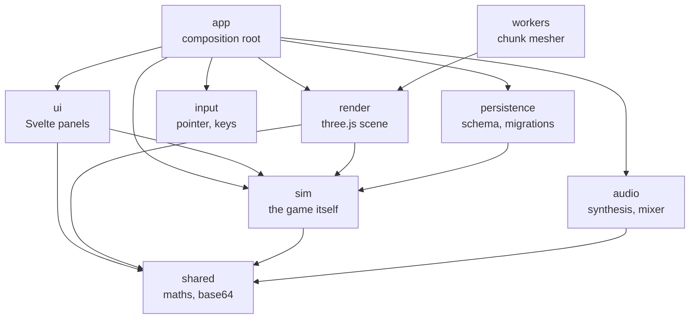
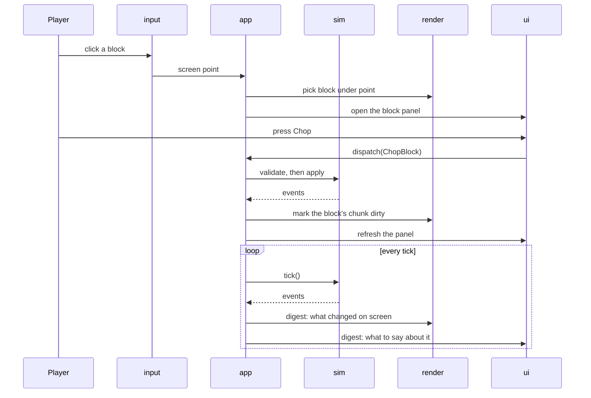

# Architecture

One rule holds the codebase together: **the simulation knows nothing about
the screen.** Everything else follows from it.

`src/sim/` is plain TypeScript with no imports from three.js, Svelte or the
DOM. It can be run headlessly, which is what `pnpm sweep` does when it plays
a few thousand years of estate to see what the balance is worth, and what the
400-odd unit tests do when they assert a rule.

## The layers

`eslint-plugin-boundaries` enforces those arrows. An import that points the
wrong way fails the lint, so the rule cannot rot quietly. The layer list lives
in `eslint.config.js` and nowhere else.

What each one is for:

| Layer         | Holds                                              | May import         |
| ------------- | -------------------------------------------------- | ------------------ |
| `sim`         | The game: state, systems, commands, balance tables | `shared`           |
| `render`      | Meshes, materials, the chunk mesher, mobs, effects | `sim`, `shared`    |
| `ui`          | Svelte 5 panels and their state modules            | `sim`, `shared`    |
| `input`       | Pointer and keyboard, translated into intent       | `shared`           |
| `persistence` | The save schema, its migrations, the slot          | `sim`, `shared`    |
| `workers`     | The mesher worker, off the main thread             | `render`, `shared` |
| `audio`       | Synthesised sound, the mixer, the settings         | `shared`           |
| `app`         | The composition root: wires all of the above       | everything         |
| `shared`      | Maths, base64, things with no opinions             | nothing            |

## Inside `ui`

`src/ui/svelte/` is one folder per panel, and the folder is the unit that
changes together: `block/`, `hud/`, `news/`, `authority/`, `shop/`,
`endings/`, `start/`. Each holds a `<name>State.svelte.ts` module and the
`<Name>.svelte` files it mounts.

The state module is the panel's public face. `App.ts` imports it and never
imports a `.svelte` file, so a panel's markup can be split or renamed without
the composition root hearing about it. `svelte/base/` holds the pieces with no
game vocabulary at all, the icon, the tooltip and the phone frame, and is the
one folder anything may import from.

## How a turn of the crank actually goes

Two things to notice.

**A command is validated before it is applied.** `validate` returns a
rejection with a reason, and the panel shows that reason on the greyed-out
button, so the player learns the rules by reading rather than by guessing.
The same function decides whether the button works and what it says.

**Events are the only way out of the sim.** `tick()` returns them and
`digestEvents` turns them into "what changed on screen": which chunks to
rebuild, which palms to redraw, what to say in a toast. Nothing in the sim
knows that any of those exist.

## The save

The estate is one `localStorage` slot plus start-of-year snapshots for the
rewind. `CURRENT_SCHEMA` is 18, and every bump has a migration that brings an
older save forward, tested by loading a v1 save and playing it. See
[ADR 0002](adr/0002-localstorage-save.md).

## Where the work happens

- **The mesher runs in a worker.** Terrain is columns, not a heightmap mesh,
  and a chunk is built off the main thread. See
  [ADR 0003](adr/0003-column-terrain-and-generated-assets.md).
- **The crowd is CPU-skinned into two draw calls.** One instanced mesh per
  species part looked cheaper until three's node renderer compiled a shader
  per instanced object, which stalled for seconds on first sight of each
  species.
- **Sound is synthesised, not sampled.** No audio files ship;
  `src/audio/synth.ts` builds every sound from noise and oscillators, which is
  why the whole game is a few hundred kilobytes.
