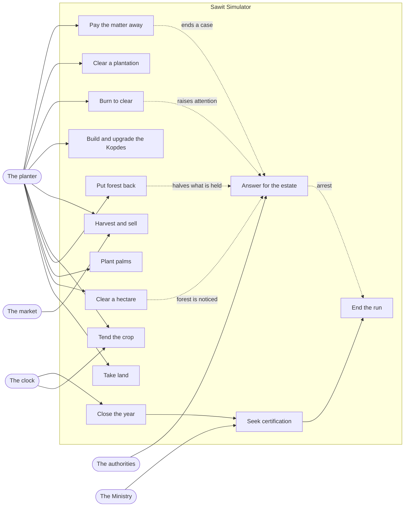
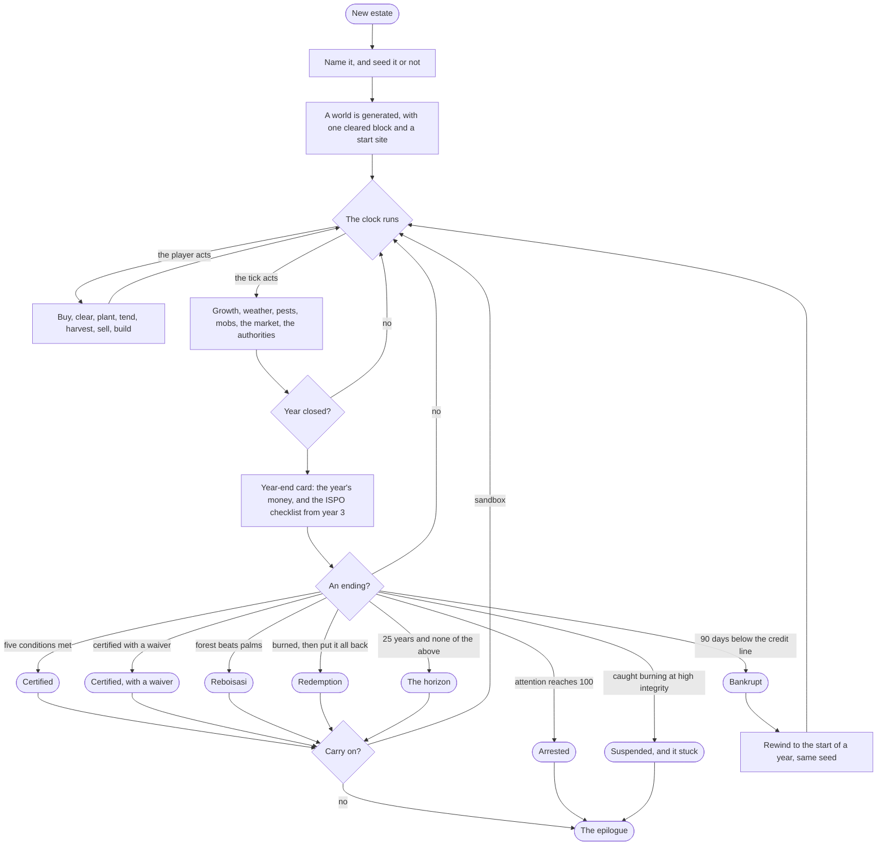
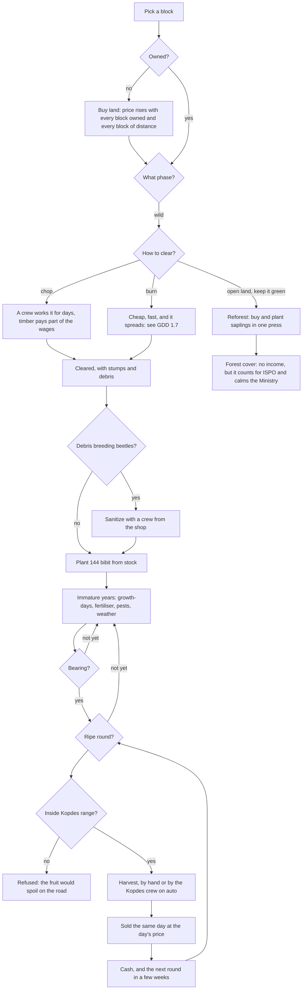
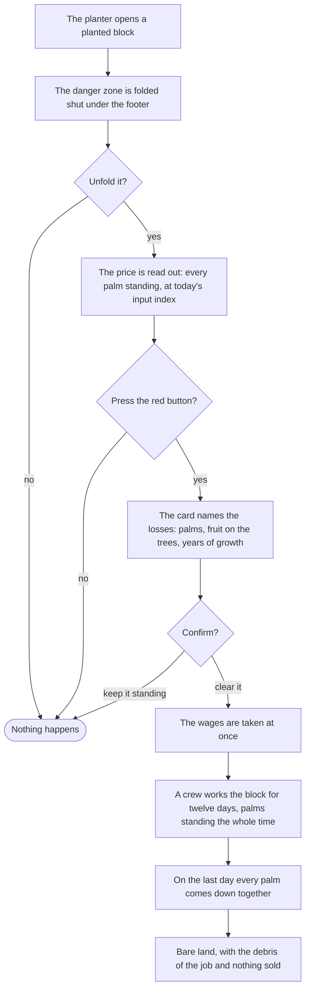
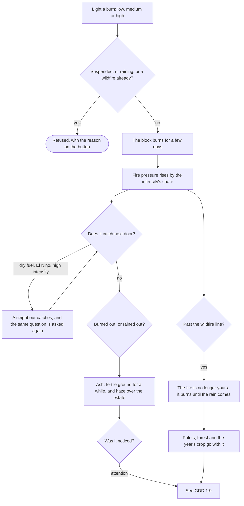
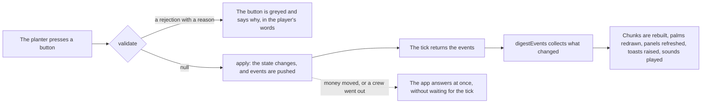
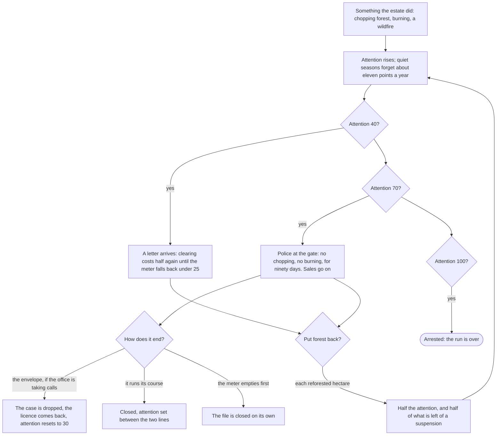
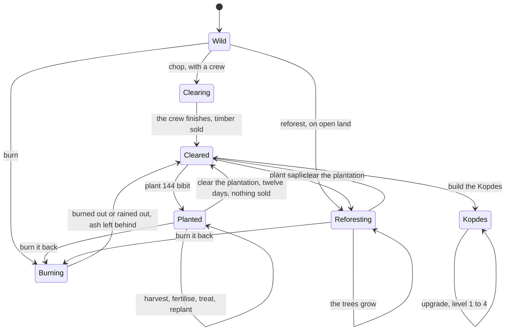

# GDD 1: the game in use

Who acts on the estate, what they are trying to do, and the shape of the flows
that get them there. The rules themselves live in the sections this one points
at; nothing here is a number.

## GDD 1.1: actors

| Actor                       | Kind      | What it wants                                                                      |
| --------------------------- | --------- | ---------------------------------------------------------------------------------- |
| The planter                 | primary   | The only human actor. Owns the estate, spends its money, answers for what it does. |
| The clock                   | secondary | Turns real seconds into days (GDD 4.2). Every system below runs off it.            |
| The weather                 | secondary | Rain, drought, haze, lightning, flood, landslide (GDD 3.6).                        |
| The Kopdes                  | secondary | The estate's own shop, crew and payroll (GDD 3.3). Inside the system, not outside. |
| The authorities             | secondary | Attention, letters, investigations, suspension, arrest (GDD 3.9).                  |
| The Ministry                | secondary | Reads the estate once a year and certifies it or does not (GDD 3.8).               |
| The market                  | secondary | The TBS price and the input price index, moved by the headline deck (GDD 3.7).     |
| Wildlife and the neighbours | secondary | Boar, monkeys, thieves, the babi ngepet (GDD 6.7). They arrive uninvited.          |

Only the planter presses anything. Every other actor acts on a tick, which is
why so much of the game happens while the player watches.

## GDD 1.2: use cases

The dotted arrows are the point of the game: the quick way to clear is the way
that draws attention, and the slow way is the way that certifies.

| Use case              | The planter's goal                               | Refused when                                            | Rules            |
| --------------------- | ------------------------------------------------ | ------------------------------------------------------- | ---------------- |
| Take land             | Own the block next door                          | Not for sale, not adjacent, not affordable              | GDD 3.1.1        |
| Clear a hectare       | Turn wild land into plantable ground             | Under investigation, already burning, protected forest  | GDD 3.1.1        |
| Plant palms           | Fill 144 slots with bibit                        | Ground not cleared, no stock, spoil from a slide        | GDD 3.2          |
| Put forest back       | Buy and plant saplings in one press              | No Kopdes in range and nothing in stock                 | GDD 3.10         |
| Tend the crop         | Keep palms alive and bearing                     | No stock of the kit, nothing wrong yet                  | GDD 3.4, GDD 3.5 |
| Harvest and sell      | Turn fruit into cash the same day                | Not ripe, out of Kopdes range, the crew has it on auto  | GDD 3.3          |
| Build and upgrade     | Reach further and unlock the payroll and clock   | Not cleared, not affordable                             | GDD 3.3          |
| Burn to clear         | Clear almost free, almost at once                | Rain, a wildfire already running, a standing suspension | GDD 3.6.1        |
| Clear a plantation    | Undo a wrong turn and get bare land back         | Nothing standing, a crew already on it, not affordable  | GDD 3.1.1        |
| Pay the matter away   | Make a case and a suspension go away             | The district office is honest that year                 | GDD 3.9          |
| Answer for the estate | Survive the letter, the case, the suspension     | Not a command: it happens to the estate                 | GDD 3.9          |
| Close the year        | Bank the year and read the card                  | Not a command: the clock does it                        | GDD 3.8          |
| Seek certification    | Meet five conditions and be read by the Ministry | Before year 3 the checklist is not even shown           | GDD 3.8          |
| End the run           | Reach one of the eight endings                   | Not a command, except carrying on in sandbox            | GDD 3.8          |

## GDD 1.3: how these diagrams are cut

Each shape answers a different question, so the subject of a diagram follows
the shape rather than the file layout:

- **One use case diagram, for the whole game.** Actors and goals. It never
  names a panel or a command, because a goal outlives both.
- **An activity diagram per flow.** A flow is one goal that crosses several
  commands and several systems and contains a real decision. That is where the
  design can be wrong, so that is what is worth drawing.
- **A state diagram per entity**, not an activity diagram. A block, a palm or a
  case has a life with states and transitions, and drawing it as a flow hides
  the one thing worth knowing, which is what it can become next.
- **No diagram per panel.** GDD 8 already describes the interface panel by
  panel, and a second drawing of the same thing would go stale on its own.
- **No diagram per command.** All 28 have the same shape, validate then apply,
  so the shape is drawn once in GDD 1.8 and each command's own rules stay in
  prose where the numbers can live beside them.

## GDD 1.4: a run, start to ending

## GDD 1.5: land to cash, the core loop

## GDD 1.6: undoing a plantation

Nothing is earned here. It is the one clearing that pays for none of what it
brings down, which is what makes it a punishment for a wrong turn rather than a
tool (GDD 3.1.1).

## GDD 1.7: fire, and what it costs

## GDD 1.8: a command, from press to pixels

Every one of the 28 commands runs this path. It is drawn once here and never
again (GDD 4.2, GDD 5).

## GDD 1.9: answering for the estate

## GDD 1.10: a block's life

A block is an entity, so it gets a state diagram rather than a flow. This is
the shape the save file and the block panel both follow (GDD 7, GDD 8).

A landslide does not change the phase: it scars the block, and the scar is dug
out or waited out (GDD 3.6.2).
