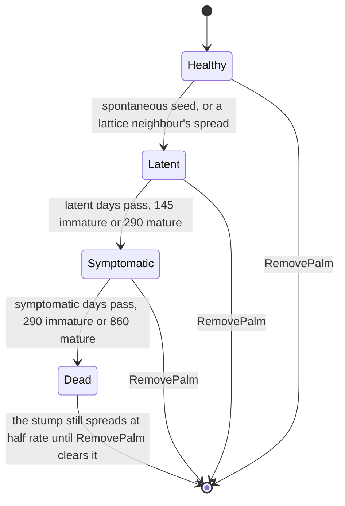
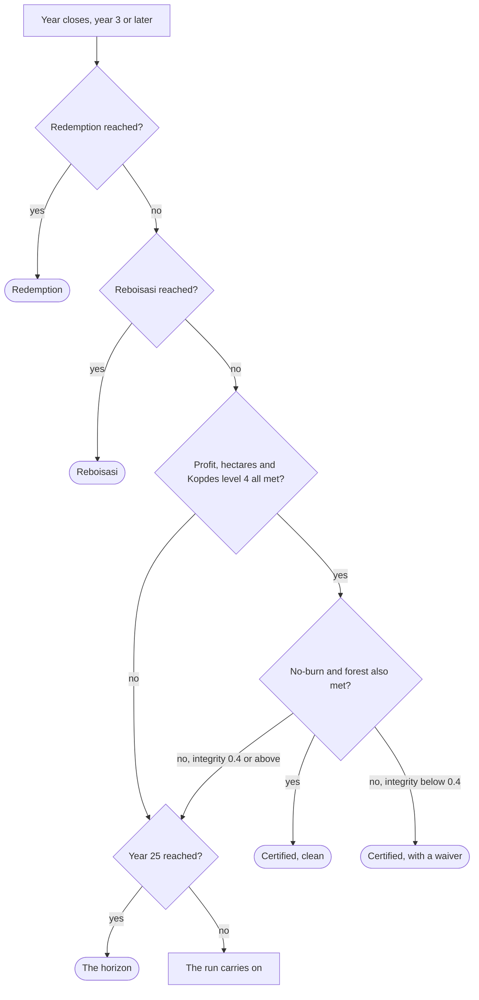

# GDD 3: the systems

Every rule below is read out of the code that runs it: the tables in
`src/sim/balance/` for the numbers, the modules in `src/sim/systems/` for how
they are applied. A citation in backticks names the constant, so a change to
one is a change to the other. Where a comment in the code disagrees with the
number beside it, or where two comments disagree with each other, this
document says so rather than picking a side; the constant is still what the
game runs on.

## GDD 3.1: clearing the land

A block is one hectare, `WORLD.blockSide` (12) palms on a side, 144 slots
(GDD 2). The estate starts as a `WORLD.startSize` (8) square, 64 blocks,
owned free with the Kopdes site pre-cleared; everything past that edge is
bought.

Every block has a biome, and the biome is what clearing actually costs
(`BIOMES` in `src/sim/balance/biomes.ts`):

| Biome      | Chop days     | Debris left | Base price | Plantable slots | Fertility | Notes                                |
| ---------- | ------------- | ----------- | ---------- | --------------- | --------- | ------------------------------------ |
| Grassfield | 10            | 0           | Rp 12.0M   | 144             | 1.0       | Open land: nothing standing to clear |
| Scrub      | 10            | 0           | Rp 6.0M    | 144             | 0.6       | Open land; dry unless irrigated      |
| Forest     | 30            | 55          | Rp 9.0M    | 144             | 1.15      | Counts as forest cover; sells timber |
| Hills      | 45            | 25          | Rp 7.0M    | 96              | 0.9       | Terraces to 96 of 144 slots          |
| Riverbank  | 12            | 10          | Rp 14.0M   | 144             | 1.2       | Forest cover; floods first (below)   |
| River      | not clearable | 0           | 0          | 0               | 0         | Never owned                          |
| Protected  | not clearable | 0           | 0          | 0               | 0         | Forest cover; not for sale           |

Peat, rubber and swamp biomes are defined in the same table with their own
costs and a village land price of Rp 40,000,000, but `worldgen` does not
place any of them yet, and village land is neither `forSale` nor `clearable`,
so none of the three is reachable in play today.

**Open land** (`BiomeSpec.openLand`, true for grassfield and scrub) has
nothing standing on it: a forest can be planted straight onto it (GDD 3.2,
GDD 3.10), skipping the chop crew entirely. Every other clearable biome needs
a crew or a match first.

**Debris** is what clearing leaves behind, 0 to 100 per block. A chop adds
the biome's `chopDebris`; a burn adds `FIRE.debrisAfterBurn` (10) or more if
palms went with it. Left alone it rots at `DEBRIS.decayPerDay` (0.04 a day),
so a chopped forest's 55 takes close to four years to clear on its own. Left
to rot, debris is what the beetle breeds in and what raises Ganoderma's
spontaneous infection chance (GDD 3.4); above `FIRE.debrisFuelMin` (20) it is
also fuel for a fire that was never meant to reach that block. `SanitizeBlock`
spends one `sanitationCrew` from stock (Rp 2,100,000 at the Kopdes) to remove
`DEBRIS.sanitizePerCrew` (60) at once; it is the only real fix, and what
makes a chopped forest's organic soil safe to plant.

**A cleared block** is `phase: 'cleared'`, `clearProgress` at 1, holding
whatever debris it has left. It can carry a Kopdes (`PlaceKopdes`), take
palms or forest (`PlantBlock`), or sit and rot; nothing about being cleared
expires.

**Riverbank floods first**: blocks at or below `FLOOD.maxElevation` and
within `FLOOD.riverDistance` blocks of the river are the ones the event deck
picks when a flood is drawn (GDD 3.6.2); riverbank's own moist, forest-cover
fertility (1.2) is the reward for the risk.

**Buying land** (`BuyBlock`) requires the block to be `forSale`, not owned,
not on fire, and adjacent to a block already owned. The price is

    BIOMES[biome].price × (1 + bought × LAND_PRICE.perOwnedBlock) × (1 + distance × LAND_PRICE.perDistance) × landFactor(state)

with `perOwnedBlock` at 0.04 and `perDistance` at 0.06 (`LAND_PRICE` in
`src/sim/balance/prices.ts`), distance in Manhattan blocks from the Kopdes
(or the world-gen Kopdes site before one is built), and `bought` the number
of blocks owned past the free starting square (`WORLD.startSize` squared, 64
today): the free square never counts toward its own price rise, so only a
purchase raises the next one, and `landFactor` is the one place a headline's
own lever reaches land prices (GDD 3.7). **Protected forest** is a cluster of high,
sloped forest promoted at world generation (`PROTECTED.minClusterSize` 14
blocks, `PROTECTED.minElevation` 2) that is never for sale and can never be
chopped: fire reaching it, or a burn lit next to it, opens a police
investigation on the spot regardless of the attention meter (GDD 3.9). A
kampung (`VILLAGES` in `src/sim/balance/world.ts`) is 2 to 4 small clusters
of house blocks along a river, also never for sale.

Two per-block upgrades round out clearing's economy: `IrrigateBlock`
(`IRRIGATION_COST`, Rp 6,000,000) lifts scrub's dry-fertility penalty to 1.0,
floors moisture at `SEASONS.irrigationFloor` (0.55) and costs
`ECONOMY.irrigationUpkeepPerDay` (Rp 3,000) a day after; `DrainBlock`
(`DRAINAGE_COST`, Rp 4,000,000) caps moisture at `SEASONS.drainageCeiling`
(0.7) and keeps the block off the flood list entirely (GDD 3.6.2). Neither
can be bought twice.

## GDD 3.1.1: chop, burn, reforest, and clearing a plantation

Four commands turn wild or planted land into something else, and each one
answers a different question about how the player got there.

**ChopBlock**, the safe way. Puts a crew on the block; `terrain()` advances
`clearProgress` by `1 / chopDays` every tick and finishes the job, adding the
biome's debris and, if the biome has one, selling its timber at once
(`TIMBER_VALUE`: forest Rp 4.5M, hills Rp 1.2M, riverbank Rp 0.9M; protected
also carries a value but can never be chopped, so it never pays out). Cost is

    chopDays × CREW_WAGE_PER_DAY (Rp 350,000) × clearingCostFactor(state) × wageFactor(state)

`clearingCostFactor` is the letter surcharge (`AUTHORITY.letterChopCostFactor`,
+50%, GDD 3.9); `wageFactor` is a macro lever (GDD 3.7). A crew of
`WORKER_JOBS.crewSize` (4) appears on the block the moment the order is
given, not on the next tick. Chopping a forest-cover biome fires
`ForestChopped`, which is what the authorities notice
(`ATTENTION.chopForest`, GDD 3.9).

**BurnBlock**, the tempting way. Flat cost `FIRE.burnCost` (Rp 250,000)
regardless of intensity, refused only when the block is not owned, is
already burning, has nothing to burn (`isFuel`), or the estate is under a
block ban, an operating ban or a police investigation (GDD 3.9). Note for
anyone reading GDD 1.2's use-case table: it lists rain as a reason burning
is refused, but nothing in `burnBlock.ts` checks the weather; a fire can be
lit in a downpour today, and only its spread (GDD 3.6.1) suffers for it.
Lighting it adds `FIRE.pressure[intensity]` (1, 3, or 5) to the estate's fire
pressure and `ATTENTION.burn[intensity]` (5, 10, 16) to attention; under an
existing wildfire every new match is forced to intensity 3. `state.run.lastBurnAt`
is stamped for the five-year no-burn ISPO condition (GDD 3.8), and the same
`BurnStarted` event ticks `run.stats.burns` up, which is the count the
secret redemption ending actually watches (GDD 3.10). What happens once
it is lit is GDD 3.6.1's business; the flow of a burn from match to smoke is
already drawn in [GDD 1.7](01-use-cases.md).

**Reforesting straight onto open land** is the third way, and it is not a
separate command so much as a shortcut `PlantBlock` takes: if the block is
still `wild` and its biome is open land (grassfield or scrub), planting
`species: 'forest'` skips the chop crew entirely and plants directly. Every
other biome must be cleared (chopped or burned) first, the same as it would
for palms. The full mechanics of buying and planting forest live in GDD
3.10.

**ClearPlantation**, the punishment. Fells every palm on a planted or
reforesting block and hauls the stumps out, priced per palm standing at the
day's input index:

    palmsStanding × CLEAR_PLANTATION.perPalm (Rp 300,000) × state.economy.inputPriceIndex

and it is the one clearing that sells nothing, because it exists to undo a
wrong turn, not to be a tool. A crew goes on the block for
`CLEAR_PLANTATION.days` (12) real days; the palms stand the whole time and
come down together on the last day, in `terrain.ts`, leaving
`CLEAR_PLANTATION.debris` (40) behind. It is refused only if nothing is
standing, a felling crew is already on the block, or the estate is under an
operating ban; unlike chop and burn it is not blocked by a police
investigation on its own. This is the flow [GDD 1.6](01-use-cases.md) draws
as the danger zone.

A field worth flagging: `Block.bannedUntil`, the per-block ban that
`ChopBlock`, `BurnBlock` and `PlantBlock` all check and refuse against, is
initialised to -1 at world generation and never set to anything else
anywhere in the sim today. The check is live code, but nothing currently
trips it; every ban a player meets in practice is the estate-wide
`operatingBanUntil` from GDD 3.8's enforcement roll, not this field.

## GDD 3.2: planting palms and forest

`PlantBlock` is the one command behind both crops: fill a cleared block's
plantable slots with palm bibit or forest saplings, taken from stock bought
at the Kopdes shop (`BuyItem`, GDD 3.3). It needs exactly
`BIOMES[biome].plantableSlots` seedlings of the right kind (`bibit` for
palms, `forestSapling` for forest) already in the inventory: 144 on flat
ground, 96 on hills. There is no partial planting; a block that is short
of stock is refused with the count it needs and the count on hand.

It is refused when the block is not owned, is on fire, carries a per-block
ban, or (for palms specifically) while the estate is under an operating ban:
planting forest back is what the ban is asking for, so that half of the
command is left open even then. It is also refused on a block still scarred
by a landslide (`landslideAt >= 0`, GDD 3.6.2): nothing takes root in spoil,
and the scar has to be dug out first.

Planting sets the block's `species` and moves its phase: `planted` for palms,
`reforesting` for forest. From wild open land there was no crew, so
`clearProgress` is simply marked done. Every slot starts at zero growth-days,
full health (255) and no Ganoderma (GDD 3.4); from there growth, pests and
weather all read the same per-block formula regardless of what is planted
(GDD 3.6.1). Planting forest additionally credits the estate against its
attention meter the moment the command applies; that credit, and everything
else about growing land back into forest, is GDD 3.10's.

## GDD 3.3: the Kopdes

The Kopdes is the estate's only building: one per estate, placed once
(`PlaceKopdes`, `KOPDES_BUILD_COST` Rp 22,000,000) on a cleared block owned
by the player. Everything the estate buys, sells and staffs runs through it.

**Range.** TBS has to reach the mill the same day it is picked (GDD 2), so a
block only sells same-day inside the Kopdes's range, measured in Manhattan
blocks:

    kopdesRange(level) = ECONOMY.kopdesRange (3) + (level − 1) × ECONOMY.kopdesRangePerLevel (2)

| Level | Range (blocks) | Upgrade cost (to next level) |
| ----- | -------------- | ---------------------------- |
| 1     | 3              | Rp 90,000,000                |
| 2     | 5              | Rp 260,000,000               |
| 3     | 7              | Rp 650,000,000               |
| 4     | 9              | max level                    |

(`KOPDES_UPGRADE_COST`, `ECONOMY.kopdesMaxLevel` 4.) A block outside range
refuses `HarvestBlock` outright, naming the distance and the range in the
rejection. The ladder climbs steeply on purpose: level 3 is also what
unlocks the payroll (`WORKERS_FROM_LEVEL`) and the 50x clock
(`TURBO_KOPDES_LEVEL` in `src/app/timeControl.ts`), and level 4 on its own is
one of the five ISPO conditions (GDD 3.8), so the top of the ladder is meant
to take years of harvests, not the opening balance.

**The shop.** `BuyItem` sells at `ITEM_PRICES[item] × shopIndex(state)`,
where `shopIndex` is the sticky `inputPriceIndex` times whatever running
headline's `inputFactor` applies today (GDD 3.7), so a currency story shows
up on the shelf immediately:

| Item             | Base price    | Used for                            |
| ---------------- | ------------- | ----------------------------------- |
| `bibit`          | Rp 38,000     | Planting palms (GDD 3.2)            |
| `forestSapling`  | Rp 21,000     | Planting or reforesting (GDD 3.10)  |
| `fertilizer`     | Rp 1,250,000  | `FertilizeBlock` (GDD 3.5)          |
| `pheromoneTrap`  | Rp 320,000    | Beetle traps (GDD 3.4)              |
| `metarhizium`    | Rp 780,000    | Beetle biocontrol (GDD 3.4)         |
| `trichoderma`    | Rp 950,000    | Ganoderma biocontrol (GDD 3.4)      |
| `sanitationCrew` | Rp 2,100,000  | One-shot debris clearance (GDD 3.1) |
| `excavationCrew` | Rp 14,000,000 | Digging out a landslide (GDD 3.6.2) |

**Auto-harvest.** `SetAutoHarvest` hands picking to the Kopdes crew: while
on, the `harvest()` system picks every ripe block in range on its own each
tick (unless ash is falling or the estate is banned) for
`HARVEST.autoSurchargePerRound` (Rp 45,000) on top of the usual
`HARVEST.crewWagePerRound` (Rp 180,000), and manual `HarvestBlock` is
refused with "the crew has it" while it runs. Harvest itself opens a block's
clock the day its first palm bears and calls it ripe every
`HARVEST_ROTATION_DAYS` (5) days; fruit left unpicked past
`HARVEST.overripeCapRounds` (1.5) rounds' worth simply rots rather than
banking, so a neglected block cannot save up a year of yield. The crew's
wage is charged but never gated on cash, because a harvest pays for itself
and an estate that could not afford to pick would spiral into a debt it
could never work off.

**The payroll**, from level 3: `HireWorker` puts a mob permanently on the
estate, paid `wagePerDay × wageFactor(state)` every day until `DismissWorker`
takes it off again (`WORKERS` in `src/sim/balance/mobs.ts`):

| Worker            | Wage/day     | Hire fee      | Does                                                                  |
| ----------------- | ------------ | ------------- | --------------------------------------------------------------------- |
| Sanitation worker | Rp 350,000   | Rp 2,000,000  | Clears the messiest block, 12 debris a day; sets traps and fertilizes |
| Plant doctor      | Rp 1,400,000 | Rp 15,000,000 | Removes 2 sick palms a day, replants the gaps, doses Trichoderma      |
| Security guard    | Rp 900,000   | Rp 8,000,000  | Patrols from the Kopdes; thieves mostly stay away                     |

Only one of each kind can be on the payroll at a time. This is the estate's
alternative to the player's own clicking: a sanitation worker never
sanitizes as fast as a stocked crew applied by hand, but it never forgets
either.

**A worker buys its own supplies.** The wage buys labour, not materials, so a
job that needs a thing from the shop takes it from `state.inventory` and, if
the shelf is empty, buys a single unit at the price the player would pay that
day (`useItem()` in `src/sim/systems/mobs.ts`). The doctor buys `trichoderma`
to dose a block and `bibit` to fill the gap behind each palm it pulls; the
sanitation worker buys a `pheromoneTrap` where the window has lapsed, and a
`fertilizer` on anything growing. It never borrows to do it: short of cash the
worker skips that job for the day and does the labour it can. Only the
item-backed jobs stop, so an estate in the red still gets its debris cleared
and its sick palms pulled.

That makes the payroll cost more than its wage line, and deliberately: the
plant doctor's Trichoderma used to be free, which made a hired doctor strictly
better than the same treatment bought by hand. The fertilizer habit is the
expensive one, at `ITEM_PRICES.fertilizer` per block per `FERTILIZER_DAYS`.

## GDD 3.4: pests

Two pests, two tempos (`src/sim/balance/pests.ts`, `src/sim/systems/pest.ts`).
Ganoderma is slow and structural: it travels palm to palm and eventually
kills. The rhinoceros beetle is fast and about housekeeping: it breeds in
what a clearing left behind and bores young palms. Debris feeds both, which
is the whole reason what a clearing leaves behind matters (GDD 3.1).

**The slot grid.** A block's 144 slots sit on a `WORLD.blockSide` × 12
triangular lattice: odd rows are offset half a slot, so every interior slot
has six neighbours (`slotNeighbours` in `src/sim/palms.ts`). Ganoderma
spreads root to root along exactly this lattice; it is also what the block
panel draws as the clickable 12x12 pest grid (GDD 8 panel 10).

**Ganoderma.** Per palm, per day, while planted:

- Spontaneous infection: `GANODERMA.baseSeedPerDay` (0.00008) plus
  `debris × GANODERMA.seedPerDebrisPerDay` (0.00003), tripled
  (`FLOOD.ganodermaSeedFactor`) while the block is flooded (GDD 3.6.2).
- An infected palm (latent or symptomatic) infects each healthy, untrenched
  lattice neighbour at `GANODERMA.spreadPerDay` (0.0013) a day, scaled up by
  standing debris (`1 + debris/100`), by `GANODERMA.plagueSpreadFactor` (1.6)
  once the block is plagued (below), and cut by `GANODERMA.trichodermaFactor`
  (0.5) while Trichoderma is active. A dead stump keeps spreading at
  `GANODERMA.stumpSourceFactor` (0.5) of that rate until it is removed.
- Progression: latent for `GANODERMA.latentDays` (145 immature, 290 mature)
  before turning symptomatic, then `symptomaticDays` (290 immature, 860
  mature) before the palm dies outright, losing its accumulated yield and
  adding `GANODERMA.debrisPerDeath` (3) debris. A symptomatic palm's stress
  is capped at `GANODERMA.stressCap` (0.6, GDD 3.6.1), so it keeps growing,
  just more slowly, until it dies.

**Beetles.** A block's population grows logistically toward a capacity set
by its own debris (`beetleCapacity = debris × BEETLES.capacityPerDebris (2)`,
nothing below `BEETLES.minDebrisToBreed` (5)), at `BEETLES.growthPerDay`
(0.06), always reseeded from `BEETLES.seedPopulation` (2) if it ever drops
that low. Above capacity, `BEETLES.spilloverPerDay` (0.01) of a block's
population flies to each neighbouring breeding site every day, so an
untouched debris pile next door still grows its own colony. Beetles bore
young palms only (mature palms are untouched, GDD 2) at an expected
`BEETLES.damagePerBeetle` (0.005) health a day per beetle on the block.

**Treatments**, each a one-block, one-window item from the shop:

| Command            | Item            | Window                            | Effect                                                 |
| ------------------ | --------------- | --------------------------------- | ------------------------------------------------------ |
| `SetTrap`          | `pheromoneTrap` | `BEETLES.trapDays` (120)          | Kills `BEETLES.trapKillPerDay` (3) beetles/day         |
| `ApplyMetarhizium` | `metarhizium`   | `BEETLES.metarhiziumDays` (90)    | Cuts beetle growth to ×`metarhiziumGrowthFactor` (0.4) |
| `ApplyTrichoderma` | `trichoderma`   | `GANODERMA.trichodermaDays` (120) | Halves Ganoderma spread (needs palms standing)         |

None of the three can be applied while one of its own kind is already
running on the block, and `SanitizeBlock` (GDD 3.1) removing the debris
itself is the only fix that starves both pests at once rather than slowing
them.

**Per-palm actions** (`palmSlots.ts`) work on one slot: `RemovePalm`
(`PEST_LABOUR.removePalm`, Rp 120,000) clears an infected or dead slot and
adds `GANODERMA.debrisPerRemoval` (2) debris, since even a felled stump
leaves something behind; `TrenchPalm` (`PEST_LABOUR.trenchPalm`, Rp 90,000)
cuts a slot's lattice links so it neither catches Ganoderma from a neighbour
nor passes it on, permanently, surviving a later replant; `ReplantBlock`
refills every empty slot on a block from stock in one press.

**Plague** is a flag, not a meter: `pestPressure = beetles / PLAGUE.beetleScale
(80) + (symptomatic + dead) / planted × PLAGUE.infectedScale (5)`, set once
pressure clears `PLAGUE.onAt` (1.25) and cleared once it falls back under
`PLAGUE.offAt` (0.6). The gap between the two is deliberate hysteresis, so a
block does not flicker in and out of plague on a single day's swing; while
flagged, Ganoderma spreads at `GANODERMA.plagueSpreadFactor` (1.6, so 60%
faster) on that block, and the news publishes `plague.start` (GDD 3.7). That
headline's own effects line claims spread "doubles" on a plagued block; the
constant it is describing is 1.6, not 2, and this document follows the code.

## GDD 3.5: fertiliser and fertility

Fertility is one of the four factors that multiply into a palm's daily
growth, `G = light × moisture × fertility × stress` (GDD 3.6.1), clamped to
`GROWTH_FACTORS.fertility` (0.6 to 1.4). It starts from the biome
(`BIOMES[biome].fertility`: 0.6 for scrub up to 1.15 for forest and 1.2 for
riverbank), except that irrigating a scrub block lifts it straight to 1.0,
removing the dry penalty rather than adding to it.

`FertilizeBlock` spends one `fertilizer` from stock to open a
`FERTILIZER_DAYS` (90) day window in which the block's fertility factor is
multiplied by `FERTILIZER_BONUS` (1.2, `src/sim/systems/growth.ts`); ash
settling after a fire or a volcanic ash fall opens the same kind of window
at the same 1.2 multiplier (`ASH_BONUS`) for `FIRE.ashDays` (90) or
`ASH.fertileDays` (90) respectively, which is the one thing in the event
deck that is a gift rather than a cost (GDD 3.6). The two windows stack if
they overlap, still capped at the 1.4 ceiling. Only planted or reforesting
blocks take fertilizer, and only one application can be active at a time; a
second is refused with the days left on the first. A flood washes a
fertilizer window out immediately (`fertilizedUntil` is pulled back to the
current tick, GDD 3.6.2).

Fertility is deliberately not stored on the block; it is computed fresh each
tick from the biome, the fertilizer window, the ash window and the clearing
history, which is why there is no `Block.fertility` field to save.

Fertiliser is not the whole cost of keeping ground productive: every planted
block, fertilized or not, costs `ECONOMY.upkeepPerPlantedBlock` (Rp 9,000) a
day in the economy system (GDD 3.3), which is what keeps the immature years
from being free.

## GDD 3.6: weather and the event deck

The calendar runs `SEASONS.daysPerYear` (360) days a year, wet season from
day 300 through day 89 (wrapping the new year) and dry the rest
(`isWetSeason`). Each day's rain is a clamped normal draw from the season's
own distribution (wet: mean 0.65, sd 0.2; dry: mean 0.4, sd 0.16), scaled by
the year's climate regime:

| Regime  | Yearly weight | Rain multiplier |
| ------- | ------------- | --------------- |
| Normal  | 0.6           | 1.0             |
| El Nino | 0.2           | 0.55 (drier)    |
| La Nina | 0.2           | 1.35 (wetter)   |

(`SEASONS.regime`.) The regime is rolled once a year with a
`SEASONS.regime.persistence` (0.3) bonus toward last year's own regime, so
dry and wet years cluster instead of alternating cleanly.

**Sky and light.** The day's sky reads off the rain draw: clear below 0.2,
cloudy below 0.45, rain below 0.82, storm at or above (`SKY`). Once set, the
sky holds for a spell of `SKY.spellDays` (6 to 14) days, drawn from its own
forked stream so that how long good weather lasts never perturbs the main
rain, price or pest rolls; a storm can still break in on any day the rain
calls for one. A "dry storm" can also strike after `SKY.dryStormStreak` (5)
dry days even on a middling sky (`SKY.dryStormChance` 0.3), which is the
mechanism that starts fires without the rain that would put them straight
out. Sunlight is `1 − SEASONS.cloudPerRain (0.15) × rain`, then multiplied by
`HAZE.light` (0.7, or `FIRE.hazeLight` 0.6 under the estate's own wildfire
smoke) while haze hangs, and separately by `ASH.light` (0.5) while ash is
falling; the two are independent events and compound if they ever overlap.
This is the light factor that feeds every palm's growth (GDD 3.6.1).

**Lightning.** On a storm day, `LIGHTNING.strikeChance` (0.45) of at least
one bolt, up to `LIGHTNING.maxStrikes` (2), landing anywhere over the
estate's box widened by `LIGHTNING.reach` (6) blocks. A strike ignites only
if the day's rain is under `LIGHTNING.soakedAbove` (0.92), the ground under
`LIGHTNING.soakedGround` (0.62), and a further roll of
`LIGHTNING.igniteChance` (0.25) lands. A lightning fire, like a drought
spark (GDD 3.6.2), is natural: it burns its own block out and never spreads,
so an act of God never costs the player a neighbour, and it raises no
attention (GDD 3.9) because nobody lit it.

**The event deck** draws at most once every `DECK.drawEveryDays` (30) days,
and even then only with `DECK.drawChance` (0.12) chance of dealing anything
at all. What it can deal is season-gated and weighted against a fixed
`DECK.referenceWeight` (1.6), so an event that cannot be drawn this month
(wrong season, or already running) hands its share to "nothing happens"
rather than to the other cards:

| Event | Season | Base weight | Regime weight (normal / El Nino / La Nina) | Duration      |
| ----- | ------ | ----------- | ------------------------------------------ | ------------- |
| Haze  | dry    | 3           | 0.4 / 2.5 / 0.1                            | 12 to 35 days |
| Ash   | any    | 0.06        | 1 / 1 / 1                                  | 3 to 10 days  |
| Flood | wet    | 2           | 0.6 / 0.1 / 2.5 (see GDD 3.6.2)            | 5 to 12 days  |

The effective weight in a draw is the base weight times the year's regime
weight, so haze in a normal year (3 × 0.4 = 1.2) is a much longer shot than
haze in an El Nino year (3 × 2.5 = 7.5). Haze's own weight also rises with
`HAZE.weightPerFirePressure` (0.5) per point of the estate's current fire
pressure, so a bad burning season makes the regional smoke likelier on top
of whatever the deck already rolled for El Nino. Haze dips the TBS price's long-run mean by `HAZE.priceDip` (8%,
GDD 3.7) and the day's sunlight, and it is folded away entirely if the
estate's own wildfire is already producing smoke, so the two are never
double-counted. Ash, when it lands, is the deck's one gift: after it clears,
every owned block gets a `ASH.fertileDays` (90) day fertility window (GDD
3.5), though while it falls it costs immature palms `ASH.immatureDamagePerDay`
(2) health a day and halves the day's sunlight.

Flood and drought are detailed in GDD 3.6.2, and the fire pressure meter,
spread and the wildfire threshold in GDD 3.6.1. The political and economic
headline deck that runs alongside this one is a separate draw, detailed in
GDD 3.7.

## GDD 3.6.1: fire

Fire's numbers are built around one line: pressures 1, 3 and 5 against a
wildfire threshold of 3, so a high burn tips it alone, a medium burn sits
exactly on the line, and low burns spaced apart never do
(`FIRE` in `src/sim/balance/fire.ts`). Burning big is a decision to lose
control, not a gamble on one.

**Intensity and spread.** A burn is low, medium or high, each with its own
clearing time and daily spread chance into a burnable neighbour:

| Intensity | Burn days (`burnDays`) | Spread/day (`spreadPerDay`) | Pressure added |
| --------- | ---------------------- | --------------------------- | -------------- |
| Low       | 8                      | 0.01                        | 1              |
| Medium    | 4                      | 0.058                       | 3              |
| High      | 2                      | 0.3                         | 5              |

Spread is scaled by the year's regime (`regimeSpreadMultiplier`: ×1 normal,
×2 El Nino, ×0.6 La Nina), by `FIRE.forestSpreadFactor` (3) into a
neighbour that is standing forest, and by that neighbour's own fuel factor:
dryness from `(FIRE.fuelWetAt (0.7) − block.moisture) / FIRE.fuelDryRange
(0.5)` clamped to 0 to 1, so a block is fully dry fuel at or below 0.2
moisture and contributes no dryness at all at or above 0.7, times an extra
`1 + debris/100 × FIRE.debrisFuel` (1) on a cleared or clearing block. Only man-made fire spreads at all;
lightning and drought sparks burn their own block out and stop
(`weather.naturalFires`). Sustained rain (`wetStreak` at least
`FIRE.extinguishWetStreak`, 2 days) gives a burning block
`FIRE.extinguishPerDay` (0.35) chance a day of being rained out, which still
counts as cleared if the block was already at least half burned through.

**Wildfire.** Once the estate's fire pressure crosses `FIRE.wildfireThreshold`
(3), decaying only slowly at `FIRE.pressureDecayPerDay` (3/180 a day), every
burning block escalates to intensity 3, spread switches to
`FIRE.wildfireSpreadPerDay` (0.3, its own gentler regime multiplier so it
never runs away entirely), and a `HAZE_EVENT` starts alongside it that
outlives the fire by `FIRE.hazeTailDays` (20). Being caught lighting a
second wildfire while already under a police investigation is one of the
two paths straight to arrest (GDD 3.9); the flow from match to wildfire to
the authorities is drawn once in [GDD 1.7](01-use-cases.md) and is not
redrawn here.

**What burning leaves behind.** A block that burns clear keeps
`FIRE.debrisAfterBurn` (10) debris, or a quarter of what it had, whichever
is more; one whose palms burned adds `FIRE.debrisFromBurnedPalms` (40)
instead; ash lifts fertility for `FIRE.ashDays` (90) days (GDD 3.5). A block
rained out partway through keeps `FIRE.debrisFromExtinguished` (15).

**What fire does to growth.** A block's `G` (GDD 3.6, GDD 2) is
`light × moistureCurve(moisture) × fertility × stress`, each factor clamped
by `GROWTH_FACTORS` (light 0.4 to 1, moisture 0.3 to 1.15, fertility 0.6 to
1.4, stress 0 to 1). Fire and its aftermath touch two of the four: haze and
smoke cut light, and ash lifts fertility for a season. Moisture follows a
bell curve (`MOISTURE_CURVE`) peaking around 0.5, so both a dry block and a
waterlogged one grow slower; stress is a palm's own health, capped at
`GANODERMA.stressCap` (0.6) while symptomatic (GDD 3.4).

## GDD 3.6.2: flood, drought, landslides, cover crop, excavation

**Flood.** Drawn from the same deck as haze and ash (GDD 3.6), but only in
the wet season, and only heavy under La Nina (weight 2.5) against El Nino's
0.1: the river rises when there is a river to rise. It floods every
non-drained block at or below `FLOOD.maxElevation` (0) within
`FLOOD.riverDistance` (2) blocks of the river. While it runs, a flooded
block's moisture is pinned to 1, its fertilizer window is washed out
(`fertilizedUntil` pulled to the current tick), it gains
`FLOOD.debrisPerDay` (1.5) debris a day, its immature palms lose
`FLOOD.immatureDamagePerDay` (30) health a day (mature palms stand), and its
Ganoderma seeding triples (`ganodermaSeedFactor` 3, GDD 3.4): wet roots
invite the rot. `DrainBlock` (GDD 3.1) takes a block off this list
permanently.

**Drought** is not drawn; it is what a long enough dry streak already is.
Once `weather.dryStreak` reaches `DROUGHT.onAtDryStreak` (12) consecutive
dry-ish days it starts on its own, and it only breaks on a day with at least
`DROUGHT.breaksAtRain` (0.5) rain, not the first damp one. While it runs,
every non-irrigated block loses `DROUGHT.moistureLossPerDay` (0.012)
moisture a day, and under El Nino specifically there is a
`DROUGHT.sparkPerDay` (0.012) daily chance a debris pile on or beside the
estate catches on its own, a natural fire like lightning's.

**Landslides.** Any block on a slope can slide in the wet season, at a daily
chance of

    LANDSLIDE.basePerDay (0.0012) × wetStreakFactor × (1 − forestCoverAround) × plantedOrUnplantedFactor × coverCropFactor × landslideFactor(state)

where the wet-streak factor climbs from 1 up to `LANDSLIDE.maxStreakFactor`
(3) as the current wet spell lengthens, `plantedFactor` (1.5) makes worked
ground slide more readily than wild ground (`unplantedFactor` 0.5), and
`forestCoverAround` is the mean forest weight within
`LANDSLIDE.coverRadius` (2) blocks: wild forest left standing is doing real
work holding a slope up, so clearing every tree around a hillside makes the
next wet season more dangerous, not less. A slide clears whatever was
planted, buries its palms, dumps `LANDSLIDE.debrisOnBlock` (35) debris on
the block itself and `LANDSLIDE.debrisBelow` (25) on the lowest owned
neighbour, and leaves a scar (`landslideAt`) that blocks replanting until it
is dealt with.

**CoverCropBlock** (`COVER_CROP.cost`, Rp 900,000) sows a cheap ground cover
between palms or on cleared ground that, once established
(`COVER_CROP.establishDays`, 90 days after sowing) and for as long as it
lasts (`COVER_CROP.days`, three years), multiplies landslide chance by
`LANDSLIDE.coverCropFactor` (0.5). It never replaces real forest cover; it
only ever halves the number forest cover is already shrinking.

**ExcavateBlock** clears a landslide scar outright: one `excavationCrew`
(Rp 14,000,000) and `EXCAVATION.crewSize` (4) diggers on the block for
`EXCAVATION.days` (6), after which the spoil, the scar and the debris are
all gone and the hectare is ground again rather than waiting out the rot.
The alternative, free but slow, is to leave the spoil and simply plant
through it once nature clears the debris on its own schedule (GDD 3.1),
which takes seasons rather than days.

## GDD 3.7: news, the macro deck, and what a headline may do

Two decks run alongside the weather's own (GDD 3.6): the political and
economic headline deck (`MACRO_EVENTS`, `src/sim/balance/macroEvents.ts`)
and the news feed that turns everything, weather included, into copy the
player actually reads (`src/sim/systems/news.ts`).

**The macro deck** draws at most every `MACRO.drawEveryDays` (60) days, with
`MACRO.drawChance` (0.3) chance of dealing anything, weighted the same way
the weather deck is; a headline flagged `calm` (like `goneFishing`) stops the
draw dead while it runs, and one flagged `triggered` is never drawn at all,
only started directly by the sim (`ecology()`, below). A headline can also
be gated `once`, `after` another headline has already landed, or
`fromYear` a given year, so the permanent, escalating stories never open a
run.

**What a headline may do**, and nothing else, because every lever is read
in exactly one place (`src/sim/macro.ts`):

| Lever                                                 | Reaches                                                                    | Read in                    |
| ----------------------------------------------------- | -------------------------------------------------------------------------- | -------------------------- |
| `tbsFactor`                                           | The TBS price's long-run mean                                              | `economy.ts`               |
| `inputFactor`                                         | Everything the Kopdes shop sells                                           | `macro.ts shopIndex`       |
| `landFactor`                                          | The price of land                                                          | `buyBlock.ts`              |
| `wageFactor`                                          | Every wage the estate pays                                                 | crews, harvest, payroll    |
| `yieldFactor`                                         | What a harvest round yields                                                | `growth.ts`                |
| `landslideFactor`                                     | The daily slide chance                                                     | `landscape.ts`             |
| `attentionDecayFactor`                                | How fast the meter forgets                                                 | `society.ts`               |
| `settleFactor`                                        | The coordination fee                                                       | `settleInvestigation.ts`   |
| `mobsQuiet`                                           | Wildlife stays away                                                        | `macro.ts wildlifeQuiet`   |
| `kopdesCashPerDay`                                    | Paid daily, only with a Kopdes                                             | `economy.ts`               |
| `forestSoftens`                                       | Halves a `tbsFactor` penalty at full forest cover                          | `society.ts tbsMeanFactor` |
| `inputRise`                                           | A permanent step in the input index (capped at `MACRO.maxInputIndex`, 2.2) | landed once                |
| `attention`, `attentionScale`, `integrity`, `ashDays` | One-off, the moment it lands                                               | `startMacro()`             |

Multipliers compound: two running headlines that both raise shop prices
raise them together, not the larger of the two. The deck's cast is invented
end to end: President Prerows, Energy Minister BehLOL, Finance Minister
Purboy, Agriculture Minister Amrun, Forestry Minister Rajuli, his deputy
Nazarra and former president Mulyonows hold offices in a kabupaten that does
not exist. What is not invented is the shape of it: a speech into a
microphone moves a seedling's price, an enforcement drive moves land, and
nobody who says either is the one who pays.

**Consequences the deck never deals.** `ecology()` (`src/sim/systems/society.ts`)
starts four headlines directly from what the estate and the province have
**Copy is what makes a headline dealable.** `drawable()` asks `hasHeadline()`
before anything else, so a headline commented out of the news files leaves the
deck entirely and takes its levers with it. Retiring one is a single edit:
comment the template out of `economic.ts`, `government.ts`, `natural.ts` or
`statements.ts` and nothing else needs touching, not the deck entry, not the
chip labels, not a test. Writing one back in is the same edit in reverse.

That rule exists because the alternative is worse than a missing headline. A
deck entry carries levers, and an entry whose words were deleted while its
entry remained went on moving land prices, wages and the authorities' patience
for months with nothing anywhere to explain why: the bar showed a chip, the
shop got dearer, and the feed said nothing. Silence is the one thing the deck
must never do, because the whole point of it is that the country is legible.

`endings.ts` is the exception and is not free to comment out: those headlines
are named in code by the endings and the authority, and a missing one is a
bug rather than a retirement. `tests/tools/newsKeys.test.ts` holds that line,
and also catches a key the code names that no file spells.

actually set alight, never from the shuffle: `hazeSeason` (yield ×0.9) once
three or more of the estate's own blocks are burning at once; `animalsGone`
(wildlife quiet) once six or more blocks carry an ash window; `onTheBrink`
(attention +8, TBS ×0.9) once the estate's forest cover falls under 0.12;
and `burnedCarcasses` (attention +18, wildlife quiet) the first time the
estate's own wildfire is running. These are written flat, without the
deck's usual joke, because they are the one place the game is not satirising
anything.

**The news feed** turns sim events into headlines through templates keyed
by event or by a derived condition (`NEWS_TEMPLATES`, four lanes: natural,
economic, government, statements), never invented by the UI. Several events
of the same kind in the same tick collapse into one headline; a key will
not repeat within its own `cooldownDays`. The feed keeps `NEWS.cap` (200)
items; each carries a title, a body and an `effects` line, the "what this
does to you" sentence the player actually reads. Headlines draw their
phrasing from their own forked stream (`NEWS_STREAM`), so which of several
equivalent sentences gets picked never perturbs the world's own future
rolls. **Every timed headline needs a matching chip label in both
`src/i18n/locales/en/events.json` and `.../id/events.json`**, or a test
fails; the chip is what the HUD's active-events strip shows while the
headline runs (GDD 8 panel 6).

## GDD 3.8: endings

A run ends one of eight ways. Five are wins or at least survivable, and can
be carried on in sandbox with `KeepPlaying`; three are not, and offer a
rewind to the start of a past year instead (`src/app/App.ts`, snapshots kept
per year the run has closed).

**Certification**, checked once a year at the close (`closeYear()` in
`src/sim/systems/endings.ts`), from `ISPO.progressFromYear` (year 3) on. Five
conditions (`ispoConditions()`):

| Condition | Passes when                                                                                                                                                                               |
| --------- | ----------------------------------------------------------------------------------------------------------------------------------------------------------------------------------------- |
| Profit    | Cumulative operating profit (land and buildings excluded) reaches `ISPO.winProfit` (Rp 6,000,000,000), and each of the last `ISPO.profitableYears` (3) closed years was itself profitable |
| Hectares  | At least `ISPO.winHectares` (20) blocks of palms have at least `ISPO.matureShare` (50%) of their palms bearing                                                                            |
| No burn   | No burn-to-clear in the last `ISPO.noBurnYears` (5) years, or ever                                                                                                                        |
| Forest    | Forest cover around the estate's own slopes is at least `ISPO.winForestFloor` (0.2); an estate with no slopes is judged on its overall cover                                              |
| Kopdes    | The Kopdes has reached `ECONOMY.kopdesMaxLevel` (4)                                                                                                                                       |

If profit, hectares and the Kopdes level are all met, the run certifies. If
no-burn and forest are also both met, the ending is **clean**. If either is
short, the Ministry waives them anyway, but only while the hidden integrity
stat is under `ISPO.waiverMaxIntegrity` (0.4): a corrupt office looks away
and the ending is **dirty**; an honest one insists on the real conditions
and the run simply carries on. This inverts the obvious reading of
integrity: a _low_ integrity stat is what lets a shortfall through, both
here and at the settlement desk (GDD 3.9).

Two rarer endings are checked first, before certification, from the same
year 3 onward: **reboisasi**, an estate that has put more land back to
forest than it holds in palms, by at least `REBOISASI.marginHectares` (2)
and at least `REBOISASI.minHectares` (6) hectares total (a reforesting
block counts once `REBOISASI.grownShare`, 50%, of its trees have grown past
sapling); and the secret **redemption** (GDD 3.10), the same forest-back
test but at only `REDEMPTION.hectares` (2), on the added condition that at
least one fire was lit by the player's own hand (`REDEMPTION.burnsAtLeast`)
and the estate has never held a palm or sold a kilogram of TBS. Redemption
is checked first, because it is the narrower story and the one that
explains why the forest went back.

If none of the above has fired by `ISPO.horizonYears` (25), the run simply
**fades**: one palm generation has passed and nobody came to read the
estate either way.

This diagram is only the once-a-year check. Two endings resolve outside it,
on whatever day they happen:

**Bankruptcy.** Every day, if cash is negative and below minus the estate's
credit line (`creditLine()`: `BANKRUPTCY.creditPerHectare`, Rp 20,000,000,
per hectare of palms inside Kopdes range, zero without a Kopdes or with the
licence suspended) for `BANKRUPTCY.daysInRed` (90) straight days, the loans
are called. If an operating ban stood at any point in that stretch the
ending is **banned**; otherwise it is plain **bankrupt**. Both offer the
rewind rather than the epilogue's sandbox option.

**Arrest**, decided the instant it happens rather than at year end, inside
the authority system (GDD 3.9): attention reaching `AUTHORITY.arrestAt`
(100), or a second wildfire lit while already under a police investigation.
Like bankruptcy and the ban, it offers the rewind rather than sandbox
(`Epilogue.svelte`'s `win` list excludes it the same way); in practice that
rewind only reaches as far back as the last year that closed before the
arrest, so an estate arrested inside its first year, before any snapshot
exists, has nothing to rewind to at all.

**The operating ban** itself is an enforcement roll, not a certainty: it can
only fire the same day a burn happens, only while integrity is at or above
`OPERATING_BAN.minIntegrity` (0.5), at `OPERATING_BAN.chance` (40%), so a
suspension is rare and always follows a scandal that has already made the
news. It shuts clearing, palm planting and harvest estate-wide for
`OPERATING_BAN.days` (90) and halves upkeep in the meantime
(`OPERATING_BAN.upkeepFactor`, 0.5, caretaker crews only).

## GDD 3.9: the authorities

Attention is a single 0 to 100 meter (`ATTENTION` and `AUTHORITY` in
`src/sim/balance/society.ts`), and every rise into it is scaled by
`attentionFactor = 0.5 + integrity`, so a low-integrity year climbs slower:
at the starting integrity of 0.25 (`INTEGRITY.start`), a raise lands at
three quarters strength. The ladder itself, and what each rung does, is
already drawn as a flow in [GDD 1.9](01-use-cases.md); the numbers behind
it are these.

**What raises it**, before the integrity scale: chopping a forest-cover
biome (`ATTENTION.chopForest`, 4), lighting a burn (`ATTENTION.burn`: 5, 10,
16 by intensity), and a fire reaching a block that is not the player's own
(`ATTENTION.fireIntoUnowned`, 6). Fire reaching protected forest, or a burn
lit next to it, opens a police investigation immediately, skipping the
40-point letter stage entirely.

**What lowers it**: quiet time, `ATTENTION.decayPerDay` (0.03, about eleven
points a year) plus `ATTENTION.reforestTricklePerBlock` (0.006) for every
block currently reforesting, both scaled by the macro lever
`attentionDecayFactor` (GDD 3.7); and planting forest, which does two things
at once. The moment `PlantBlock` applies with `species: 'forest'`,
`creditReforestation()` multiplies attention by `1 − AUTHORITY.reforestationRelief`
(0.5, so it halves) and halves whatever is left of a running investigation
or operating ban the same way; then, the next tick, the authority system
sees the `BlockPlanted` event and subtracts a further flat
`ATTENTION.reforestPlant` (12). The two effects stack; putting forest back
is the one thing the Ministry takes entirely at face value.

**The two warnings.** At `AUTHORITY.letterAt` (40), a letter arrives:
clearing costs `AUTHORITY.letterChopCostFactor` (+50%) more until attention
falls back under `AUTHORITY.letterClearsBelow` (25). At `AUTHORITY.investigationAt`
(70), or immediately on a fire that reached protected forest or unowned
land, the police open a case: no chopping or burning (sales continue) for
`AUTHORITY.investigationDays` (90) days, or until it is settled. A case
that runs its full term closes with attention pulled down to at most
`AUTHORITY.investigationClosesAt` (45), just under the letter line, so a
meter still sitting at 70 does not reopen the same case on the day it
closes. An empty meter closes a standing case early on its own.

**Settling it.** `SettleInvestigation` is only offered while
`state.society.integrity` is at or below `AUTHORITY.settleMaxIntegrity`
(0.4): a district office has to be crooked enough to take the call.
The fee is

    (AUTHORITY.settleCost (Rp 320,000,000) + (operatingBanned ? AUTHORITY.settleBanExtra (Rp 180,000,000) : 0)) × inputPriceIndex × settleFactor(state)

roughly a year of good harvests, and it clears the investigation, the
operating ban and the letter surcharge in one press, resetting attention to
`AUTHORITY.settleAttention` (30). It is the single most expensive button in
the game, and, like the ISPO waiver (GDD 3.8), it is corruption that helps
the player, not honesty.

## GDD 3.10: reforestation

Putting land back under forest is one command, `ReforestBlock`, that does
in one press what used to be two: it buys exactly the shortfall of
`forestSapling` the block needs (using saplings already in stock first, so
a block out of Kopdes range can still be reforested from what the estate is
carrying) and plants it, sharing every validation `PlantBlock` already
enforces for `species: 'forest'` (GDD 3.2) except a bare stock shortfall,
which is this command's whole reason to exist. Buying the shortfall needs a
Kopdes in range only if a purchase is actually needed; the price is

    shortfall × ITEM_PRICES.forestSapling (Rp 21,000) × state.economy.inputPriceIndex

which, unlike a shop purchase through `BuyItem`, reads only the sticky input
index, not a running headline's temporary `inputFactor` (GDD 3.7): a top-up
bought this way is not moved by the week's news the way a deliberate trip to
the shop is.

**Growth.** A reforesting block runs on the same growth machinery as palms
(GDD 3.6.1), with its own thresholds (`FOREST_GROWTH` in
`src/sim/balance/growth.ts`): a seedling becomes "immature" at
`saplingDays` (40 growth-days) and "mature" at `matureDays` (360
growth-days), which at the growth rate the rest of the tables are calibrated
to (`G` averaging close to 1.0 a day, GDD 3.6) is about a year of cover from
a standing start. Reforestation used to take 1720 growth-days, nearer five
years, and almost nobody would spend a run waiting for it: land put back has
to pay inside the run or the choice is theatre. The stages are seedling,
immature and mature, three in all.

**Forest cover** is what every slope's landslide chance and the estate's own
ISPO forest condition read (`forestWeight()` in `src/sim/landscape.ts`):
wild forest counts as `FOREST_COVER_WEIGHT.wild` (1), a reforesting block
counts `FOREST_COVER_WEIGHT.reforestYoung` (0.5) once past `saplingDays` and
the full `reforestMature` (1) once past `matureDays`. A young reforesting
block is worth half a mature one to a slope, but still worth something from
the day it takes.

**What it is worth to the authorities and the market** is GDD 3.9's
`creditReforestation()` and GDD 3.7's forest-softened `tbsFactor`
respectively; what it is worth to the run itself is two endings, reboisasi
and the secret redemption, both defined in GDD 3.8 against the same
`reforestedHectares()` count this section's growth thresholds feed.
