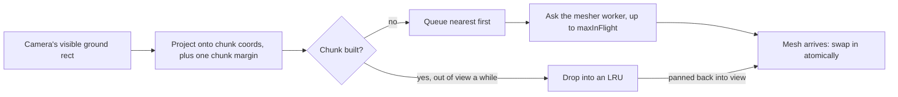

# GDD 6: the look

The estate is drawn as boxes, lit flat, coloured from one shared strip, and
moved by hand-written curves rather than physics. `src/render/` and
`src/audio/` read a `SimState` and produce a scene and a soundscape; nothing
in this section touches the sim back. The how of each piece is written out in
[`render-core.md`](../reference/render-core.md),
[`render-scene.md`](../reference/render-scene.md),
[`render-mobs.md`](../reference/render-mobs.md),
[`render-models.md`](../reference/render-models.md) and
[`audio.md`](../reference/audio.md); this section is what the result is meant
to look and sound like, and why it is built the way it is.

## GDD 6.1: the box aesthetic and the real-place palette

Everything on screen is boxes arranged well: a palm is a column of tapered
boxes, a house is a box under a box, a cloud is a stack of slabs. There is no
sculpted geometry anywhere in `src/render/geometry/` or `src/render/models/`.

Colour comes from one set, the real place rather than a stylised guess:
saturated sawit green, yellow-green young fronds, laterite red-orange soil,
dark peat brown, ochre grassfield (`COLOURS` in
`src/render/materials/palette.ts`). The material is `MeshLambertNodeMaterial`
with `flatShading = true`: flat faces, diffuse light only, no specular
highlight anywhere in the world (`src/render/materials/paletteMaterial.ts`).
A box lit flat reads as a box; a specular highlight would make it read as
plastic.

Column heights snap to a half-unit step (`HEIGHT_QUANTUM = 0.5` in
`src/render/scene/chunkField.ts`, via `quantise()` in `src/shared/math.ts`),
which is what keeps the terrain reading as terraces cut by hand rather than a
smooth, sculpted hillside. The weather and scenery painted over that terrain
keep to the same palette: clouds are small, see-through, palette-coloured
slabs that drift over the estate (`src/render/scene/Clouds.ts`), rain is
streaks whose thickness follows the day's rain (`src/render/scene/Rain.ts`),
and the river is drawn as a smooth, meandering channel rather than the block
staircase the simulation actually reasons about
(`src/render/scene/riverChannel.ts`).

Two facts about that palette are easy to get wrong, and both are stated
outright rather than left to be discovered by squinting at a colour picker:

- **Colours are authored in linear space.** The palette texture's
  `colorSpace` is `LinearSRGBColorSpace`, not `SRGBColorSpace`
  (`createPaletteTexture()` in `palette.ts`). A hex value copied in expecting
  sRGB gamma will not match what appears on screen.
- **The alpha channel is an emission mask, not opacity.** `writeHex()` writes
  alpha from a slot's `EMISSION` value (0 to 1), and every material this
  palette feeds reads that value as "how much of its own light this slot
  gives off", never as transparency. A coin or a sparkle carries emission; a
  leaf does not.

The mechanism behind both of these, the texture layout and the material that
samples it, belongs to GDD 6.4; this section is what the choice is for.

## GDD 6.2: the camera and how the player points at things

The camera is a fixed orthographic rig, not a free one
(`src/render/camera/MapRig.ts`). Pitch is constant at 35 degrees
(`PITCH = (35 * Math.PI) / 180`); azimuth is snapped to one of four diagonals
(`DIAGONALS = 4`) and eased between them with `easeOutCubic` over
`DURATION.cameraFocus` (450 ms); zoom is the orthographic frustum size
(`baseFrustum`, default 110 world units tall) rather than a dolly move.
`MapControls` owns the drag and the wheel; `MapRig` owns where the camera
actually ends up, so rotation snapping, the pan bounds
(`BOUNDS_MARGIN = 24` world units past the map edge) and the focus tween are
all first-class rather than side effects of the controls library.

Pointer input reads that same fixed camera: a click selects a block, a
double-click focuses the camera on it, and `MapControls` owns any press that
turns into a drag, so a pan is never mistaken for a click
(`src/input/pointer.ts`). Picking a block is a raycast against the terrain
chunks, falling back to a ground-plane intersection while a chunk is still
loading, then converting the hit point to a block index with
`WORLD.blockSide` (`Picker.pickBlock()` in `src/render/picking.ts`). Per-palm
picking against the instanced meshes is not built yet.

Keyboard shortcuts cover the same ground as a mouse: space pauses, 1, 2 and 3
pick a speed, Q and E snap-rotate the camera a quarter turn, F jumps to the
Kopdes, K opens the shop, N opens the news, H or `?` opens the controls
help, and Escape closes whatever is open (`src/input/keys.ts`).

## GDD 6.3: procedural geometry, from a palm to a building

Every model, terrain included, is built the same way: a function adds boxes
to a `BoxBuilder` at a placement (`src/render/models/kit.ts`). Models
describe themselves in local space, origin on the ground at the model's foot
with +Y up, and the kit applies position, turn and scale. A model draws from
a seeded `rand`, so the same spot on the map always grows the same tree.

The oil palm is the model this rule was built for
(`src/render/geometry/palm.ts`): a column of tapered boxes with a subtle
S-bend for the trunk, and a crown of flat, tapering slabs that droop off it.
One generator, `PALM_STAGES`, and four parameter sets: `frondCount` is 5 for
a seedling, 8 for an immature palm, 10 for a mature one and 9 for a senile
one, with droop increasing from 0.32 to 0.62 radians across the same four
stages, and only mature and senile palms carry fruit bunches (`bunches: 3`
and `bunches: 1`). A frond's outer segments split into leaflets rather than
staying a single paddle: the second-last segment fans to `FAN_MID`
(`[-0.13, 0, 0.13]`) and the tip fans wider still to `FAN_TIP`
(`[-0.26, 0, 0.26]`), which is what makes the crown read as leaves at a
distance rather than as a scoop.

The column terrain mesher (`src/render/geometry/terrain.ts`) is built from
the same box primitive: one box per world column, reaching down only as far
as its lowest exposed neighbour, with every face against an equal or taller
neighbour skipped. `quantise()` (`src/shared/math.ts`) is what both this
mesher and the props grid snap to, so a tree and the ground under it agree on
where the ground actually is.

The Kopdes building grows in one direction as it levels up
(`buildKopdesGeometry()` in `src/render/scene/Kopdes.ts`): west, `-x`, holds
the ridge, and the roof falls east over the walls, so a level-up reads as the
same building getting bigger rather than a different building appearing.
Police cars at the Kopdes (`src/render/scene/Police.ts`) and the fence along
the edge of a planted crop (`growFence()` in `src/render/scene/props.ts`) are
built the same boxy way. The full model catalogue, one entry per file, is
[`render-models.md`](../reference/render-models.md).

## GDD 6.4: the palette strip, the shared material, and weather-driven light

Every static vertex in the world carries a `paletteU` attribute instead of a
UV (`BoxBuilder`), addressing one column of a `256x2` texture
(`PALETTE_WIDTH = 256` in `src/render/materials/paletteSlots.ts`): row 0 is
the wet-season colour for that slot, row 1 is the dry-season colour.
`createPaletteMaterial()` samples both rows, `mix()`es them by a `season`
uniform (0 wet, 1 dry), then mixes an event tint on top by a `tintAmount`
uniform: `TINT.haze` (amber-grey, `0xc9a06a`) or `TINT.ash` (grey,
`0x9a9a9a`). Two floats, `season` and `tintAmount`, shift the mood of the
entire world at once; nothing is recoloured object by object.

The alpha channel from GDD 6.1 becomes `emissiveNode`: the tinted colour
multiplied by the wet row's alpha and `EMISSION_GAIN` (0.55), enough to put a
fully emissive slot (a coin, a sparkle, a golden capybara's fur) over the
bloom pass's threshold without burning out to white. The bloom pass itself
(`src/render/Glow.ts`) only runs while something is burning: `GLOW.strength`
is 0.6, `GLOW.radius` is 0.35, and `GLOW.threshold` is 0.7, so sunlit sand
never blooms and flame particles, which are written brighter than white on
purpose, always do. A comment in `paletteMaterial.ts` describes the target as
"just over the bloom threshold (1.1)"; the live threshold read by
`Glow.ts` is `0.7`, so that comment is stale against the code it sits next
to rather than a second, larger threshold somewhere else.

The renderer itself is WebGPU with an automatic WebGL 2 fallback
(`createRenderer()` in `src/render/Renderer.ts`), and a `forceWebGL` switch
so CI and the Playwright smoke test exercise the fallback path on purpose
(`?webgl`); WebGPU is not available in headless CI, which is why the e2e
suite always boots on the fallback. Weather rides the same two-float system:
`Sky.ts` builds the sky, fog and lights from the day's weather before
anything else in the scene, because it carries the game's atmosphere, and
smoke or ash amounts ease toward their targets rather than switching on, so a
haze season settles over the estate instead of snapping into it. A sick
palm's fronds (yellowed, with a dark Ganoderma rot band at the trunk's base)
are painted the same way, through palette slots rather than a second
material (`src/render/geometry/palm.ts`).

## GDD 6.5: animation: curves, springs, and what an event looks like

Every curve in `src/render/anim/easing.ts` maps `t` in `[0, 1]` to a value
starting at 0 and ending at 1; the "back", "elastic" and "bounce" families
overshoot on the way there on purpose. This file is the CPU half of the
curve library; `easingTSL.ts` holds the same curves as TSL nodes for
per-instance animation on the GPU, because thousands of palm instances
cannot be posed one at a time per frame. [ADR 0007](../adr/0007-easing-parity.md)
is the record of why both exist: `tests/render/easing-parity.test.ts` samples
every curve at 32 points on each side and fails if they disagree, so a palm
never lands differently from the selection ring around it.

`squashStretch()` is a modulation around 1 applied on top of whatever base
scale an animation already has, not the base scale itself: vertical scale is
`sy = 1 + amount * (curveValue - 1)` and both horizontal axes take
`1 / sqrt(sy)`, which keeps `sy * sxz * sxz === 1`, volume-preserving. Wall-
clock durations live in one table, `DURATION`: `popIn` 400 ms, `popOut`
250 ms, `grow` 700 ms, `fall` 700 ms, `topple` 900 ms, `shiver` 300 ms,
`cameraFocus` 450 ms, and a per-instance cascade of `cascadeStep` 15 ms
capped at `cascadeCap` 300 ms total, so a block's rows pop in one after
another without a large block taking visibly longer to finish than a small
one. Animations read these wall-clock milliseconds, never sim time, which is
what keeps a pop-in readable even when the clock is paused or running at
50x.

Interruptible motion, where the target can change mid-flight, uses a damped
harmonic oscillator instead of a curve (`src/render/anim/spring.ts`),
integrated semi-implicit Euler in substeps capped at `MAX_STEP = 1 / 120` so
a long frame cannot blow the integrator up. `TOY_SPRING` (`k: 170, c: 14`,
zeta of about 0.54) is measured to settle within about 1.3% of target at
600 ms, which is the wobble GDD 6.5 promises for hover and selection feedback
(`tests/render/easing.test.ts`); `CALM_SPRING` (`k: 120, c: 24`) is for the
camera and panels, which never overshoot. The camera's own focus and
rotation tweens use `easeOutCubic` rather than a spring, for the same reason:
the camera eases and never bounces.

The rest of GDD 6.5 is the catalogue of what a tick's events turn into on
screen, each one purely visual and driven by the app's wall clock rather
than the sim: the certificate ceremony's banner popping in with `easeOutBack`
(`src/render/scene/Ceremony.ts`), gold coins arcing and settling into the
grass on any payout (`src/render/scene/Coins.ts`), the presidential
motorcade on a clean or dirty certification (`src/render/scene/Motorcade.ts`),
sparkles marking something worth a click (`src/render/scene/Sparkles.ts`),
trees felled one at a time as a forest block is chopped
(`src/render/scene/Timber.ts`), the smoke that follows a babi ngepet
(`src/render/scene/Wisps.ts`), and the timber-and-rope work site around a
crew that is chopping or burning (`src/render/scene/WorkSite.ts`). Palm
pop-in and grow animations are stepped on the CPU in
`src/render/scene/Palms.ts` today; a GPU per-instance path takes over only
once palm counts justify it. `src/render/sync.ts` is where a tick's events
become a decision about which of these to play, kept in one place so the
event-to-visual mapping has a single home rather than one branch per scene
module.

## GDD 6.6: sound, picking, and keeping the crowd cheap

The audio mixer (`src/audio/Audio.ts`) runs one shared `AudioContext` split
into four buses, `ui`, `world`, `drama` and `music` (`type Bus`), so a player
can turn down the world's noise without losing the UI's feedback. Nothing is
created until the player's first gesture, because a browser refuses to start
an audio context without one; until then every call is a no-op, which is
also what lets the sim and the tests run with no audio at all. A fast clock
throws sound-triggering events in handfuls, so a bus is rate-limited: no more
than `MAX_PER_FRAME` (3) one-shots per 16 ms frame, and the same sound cannot
retrigger inside its own `MIN_GAP_MS` (`ui-button-press` 40 ms, `chop-stroke`
90 ms, `coins-burst` and both cash sounds under 150 to 120 ms, everything
else `DEFAULT_GAP_MS` 60 ms). The player's mute and volume choice persists
in one `localStorage` key, `AUDIO_STORAGE_KEY = 'sawit:audio'`
(`src/audio/settings.ts`), read once at boot and written on every change.

None of the estate's noises are recorded audio; every one is synthesised
from primitives in `src/audio/synth.ts` (noise buffers, resonant filters,
slow aperiodic `drift()`) so the same recipe plays live through an
`AudioContext` and renders offline through an `OfflineAudioContext`, which is
how the tests measure a sound without a speaker. Thunder, rain, fire in two
takes, and the rest are written out this way in `src/audio/sounds.ts`.

Picking a block is a raycast against the terrain chunks
(`Picker.pickBlock()`, GDD 6.2 covers the input side of the same code).
Palms are drawn as one `InstancedMesh` per growth stage and variant, plus
stumps, rebuilt wholesale from sim state whenever a planted block changes
rather than tracked slot by slot, because a few thousand matrices is cheap
enough to redo (`src/render/scene/Palms.ts`). The mob crowd takes the
opposite approach on purpose: [ADR 0006](../adr/0006-cpu-skinned-crowd.md)
records that an `InstancedMesh` per species part looked cheaper on paper but
made three's node renderer compile a fresh shader per part the first time it
appeared on screen, a multi-second stall exactly when something new walked
on; CPU-skinning every mob into a shared vertex buffer, two draw calls for
the whole crowd, costs a little CPU per frame and compiles nothing new,
ever. The far-LOD heatmap tiles that would let the camera zoom out past the
near ring are not built yet; zoom is clamped by `MapRig` in the meantime.

## GDD 6.7: chunk streaming and the mesher's budget

The world is meshed in chunks of `WORLD.chunkSide` (4) blocks per side, the
same 4x4 sim-chunk partition the save format uses (GDD 7), which puts a
chunk at 48x48 columns (`CHUNK_COLUMNS` in `src/render/scene/chunkField.ts`).
Each frame, `ChunkManager` projects the camera's visible ground rectangle
(`MapRig.visibleGround()`) onto chunk coordinates plus a one-chunk margin,
queues missing chunks nearest first, asks the mesher worker for at most
`maxInFlight` at a time, and drops chunks that have been out of view for a
while into an LRU so panning back is free:

`workers/mesher.worker.ts` builds one chunk's column mesh per request and
posts the arrays back as transferables; it holds its own copy of `World`,
rebuilt from the seed on first use, so the main thread never serialises
terrain to the worker or back (`src/render/scene/chunkProtocol.ts`). A
culled 48x48 chunk is budgeted at roughly 6,000 to 10,000 triangles, plus
trees and props on top (`tests/render/chunkField.test.ts`); `BoxBuilder`
tracks its running triangle count for exactly this assertion. Chunk edges
use `ColumnField.inset: 1`: columns within one column of a chunk's border
are neighbour context only, culling the faces beside them without being
drawn themselves, so a chunk's border is culled against its neighbour rather
than walled down to the floor.

One citation stands apart from the rest: `docs/gdd/01-use-cases.md` cites
GDD 6.7 for the wildlife actor row (boar, monkeys, thieves, the babi
ngepet), while every other citation of GDD 6.7, in `render-core.md`,
`render-scene.md`, `workers.md`, `MapRig.ts`, `boxBuilder.ts`, `world.ts`
and the chunk field tests, is about chunk streaming and the mesher's
triangle budget. That row's reference looks like a mismatched section
number rather than a second subject sharing GDD 6.7; it is left as found
here rather than guessed at.

## GDD 6.8

Nothing in `src/` or `docs/reference/` cites GDD 6.8. The numbering runs
from chunk streaming (GDD 6.7) straight to the art spike (GDD 6.9) with no
hint of what would sit between them, so this section stays unused rather
than inventing a subject for it.

## GDD 6.9: the art spike

`src/app/Spike.ts` is deliberately pre-sim: no `sim/` imports, no game
state. It exists to prove the art direction and the WebGPU and TSL
instancing stack before M1a builds anything on top of it, and it is kept
reachable in every build behind `?spike` for tuning the look after the fact
(`src/main.ts`). It is one flat 12x12 block with stepped edges, 144
procedural slab-frond palms, a hemisphere plus directional light, linear
fog, a `season` slider that lerps the wet and dry palette, a `haze` slider
that moves fog colour and density and the event tint together, and a
"Replant" button that pops all 144 palms in with the row cascade from GDD
6.5.

Its pass criteria are stated as a look rather than a number: it should read
as Kalimantan in September at one end of the sliders and a wet January at
the other, the fronds should read as palms from the diagonal the fixed
camera actually uses, and the cascade pop-in should make you want to press
Replant again. `?webgl` forces the WebGL 2 fallback here too, which is what
lets the Playwright smoke test (`e2e/spike.spec.ts`) and CI exercise the
same rendering path a real browser would only take without WebGPU support.
