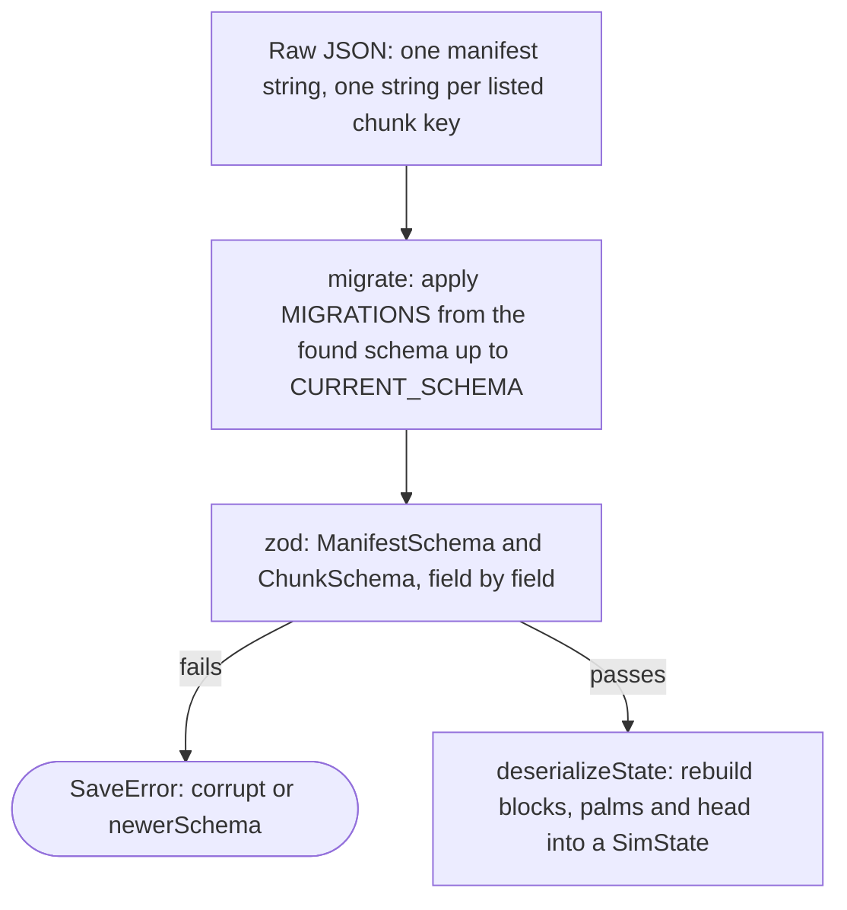

# GDD 7: saving

There is no backend, so a save has to survive a reload on its own. GDD 7 has
no lettered subsections in the code: every citation is plain `GDD 7`, which
is why this file reads as one topic rather than a run of `7.1`, `7.2` and so
on. [`ADR 0002`](../adr/0002-localstorage-save.md) is the decision this
section states in prose; [`persistence.md`](../reference/persistence.md) is
the module-by-module how.

## The save slot

A save lives in `localStorage`, behind an adapter
(`src/persistence/storage.ts`), never touched directly by anything else:
moving to IndexedDB later is a new adapter, not a change to callers. Every
key starts with `KEY_PREFIX = 'accursed-forest'`. A slot is one manifest key,
`${KEY_PREFIX}:save:${slot}`, plus one key per sim chunk that holds at least
one block diverged from world generation, `${manifestKey}:c:${chunkKey}`
(`SaveSlot` in `src/persistence/chunks.ts`). A chunk key is `cx:cy` from the
same 4x4 block partition the renderer streams by (`chunkKeyOf()` in
`src/persistence/schema.ts`, `WORLD.chunkSide = 4`), which is why
`world.ts` cites both GDD 6.7 and GDD 7 on the one constant: the mesher and
the save format share a grid on purpose, so a large estate's autosave and a
large estate's chunk streaming are cut the same way. Untouched land is never
stored at all; the world regenerates from its seed, so a 64x64 map with a
modest estate on it costs kilobytes, not megabytes.

`SaveSlot.save()` writes chunks first and the manifest last, and returns
every storage key it touched in that order. Chunk payloads are compressed
with `lz-string`'s `compressToUTF16`, because `localStorage` itself stores
UTF-16, so that is the encoding that actually shrinks the footprint on disk;
the manifest is left as plain JSON by default, readable while debugging.
Year snapshots (below) turn manifest compression on too, because a late-game
manifest, 25 years of command log and news, runs to roughly 260,000
characters uncompressed. Loading accepts either form for the manifest, so an
old, uncompressed manifest still opens.

Writes are not atomic across keys. A crash between a chunk write and the
manifest write leaves the old manifest pointing at the same chunk keys with
one chunk newer than the rest: a block or two a tick ahead, never a corrupt
save. The alternative, versioned chunk keys and an atomic swap, was rejected
as not worth the machinery for a save that autosaves every 30 sim days
(`Autosave.everyTicks`, below) rather than every write.

## What a manifest and a chunk hold

The split between the two is deliberate: the manifest is everything that is
one per save, and a chunk is everything that is one per patch of land.
`ManifestSchema` carries the seed, the world generation parameters, the
estate's name, and `head`, which is the single-copy game state: the tick,
the RNG, the economy, the weather, society (attention, the letters, the news
feed), the run (profit, stats, the chronicle, the ending if any), the
Kopdes, the inventory, every mob, and the command log. `ChunkSchema` carries
only `blocks` and `palms` for the one chunk it names: a `BlockSchema` per
diverged block (phase, debris, moisture, whether it burns, whether it is
owned, and so on) and a tuple of `[blockId, PalmArraysSchema]` per block that
has palms, where `PalmArraysSchema` is the typed-array columns
(`plantedAt`, `growth`, `health`, `ganoderma`, `yieldAcc`, `ganodermaSince`,
`trenched`), one entry per planting slot, base64-encoded. A block that has
never diverged from world generation appears in neither.

## The schema

`CURRENT_SCHEMA` in `src/persistence/schema.ts` is `18` today. The rule this
section exists to state is the one `CLAUDE.md` already gives as a
non-negotiable: **every change to saved state is a schema bump, a migration,
and a key order in the encoder that matches the state**, all three, not one
or two of them. `serializeState()` builds the manifest's `head` field by
field, in a fixed order, rather than spreading the live `SimState`, and
`deserializeState()` decodes the same way; a shape change to `sim/types.ts`
that the encoder or decoder does not also change is a compile error there,
via `AssertBlockSchemaMatches` and `AssertCommandSchemaMatches`, rather than
a runtime surprise found by a player's broken save.

Every field is validated with `zod` on load, so a corrupt or hand-edited save
fails loudly with a `SaveError` (`missing`, `corrupt`, `newerSchema` or
`quota`) rather than three years into a run. Typed arrays, the palm columns
in particular, travel as base64 over a little-endian assumption that every
platform the game runs on shares (`src/shared/base64.ts`); a save exported to
JSON and reopened elsewhere carries that assumption with it as the same
strings. `vite.config.ts` stamps the build's `package.json` version into
`__APP_VERSION__`, which lands in every manifest's `app` field, defaulting to
`'0.0.0-dev'` outside a proper build.

## Migrations

`MIGRATIONS` in `src/persistence/migrations.ts` is an ordered list of
`{ from, up(save) }` steps, one per schema bump so far, 17 of them from
schema 1 up to schema 18. `migrate()` walks the raw JSON forward one step at
a time before it is ever handed to `zod`, refusing outright (`SaveError`,
code `newerSchema`) a save whose schema is higher than `CURRENT_SCHEMA`: a
save from a build the running one has never heard of is never half-read.
Missing a step for the schema in hand is also a hard failure rather than a
skip, so a gap in the chain is caught in review rather than in a player's
browser.

Most steps default a new field with `??=` (a v11 save's mobs never carry a
`climb` value, so it becomes 0; an old estate has no mobs at all, so `mobs`
becomes `[]`). Two are worth naming because they show the two shapes a
migration takes. Schema 4 to 5 (M1g, endings) rebuilds `run`'s profit books
from what a v4 save actually kept: it walks the ledger to split `yearProfit`
from `profitTotal`, since the ledger itself is capped, so the rebuilt profit
is a floor on the true figure rather than the figure itself. Schema 12 to 13
(redemption) changes nothing in the save at all; the step exists only so
that a build written before the redemption ending was invented refuses an
old save's schema number cleanly instead of choking the first time it reads
`run.ending` and finds a value it has never seen.

## Year snapshots and the rewind

A bankrupt estate rewinds to the start of its year rather than ending the
run outright (GDD 3.8), which needs a snapshot of every year to rewind to.
`App.ts` keeps the last `SNAPSHOTS_KEPT` (25) of them, one per slot named
`year:<n>`, each with `compressManifest: true` set unconditionally, because
by year 12 or so an uncompressed manifest is already too large to write
comfortably every year. `writeSnapshot()` prunes down to `SNAPSHOTS_KEPT - 1`
existing years before writing a new one, then retries the write itself up to
`SNAPSHOTS_KEPT` times, deleting the oldest remaining snapshot each time it
catches a `QuotaError`; if the disk is still full with nothing older left to
evict, it gives up and warns through a toast rather than losing the run. A
fresh run clears every snapshot newer than year 0 first, because an old
run's snapshots would otherwise rewind a new estate into somebody else's.

## Storage adapter and failure modes

Everything above goes through the same `KeyValueStorage` interface
(`get`, `set`, `remove`, `keys`), so `localStorageAdapter()` wrapping
`window.localStorage` and `memoryStorage()` for tests are interchangeable
(`src/persistence/storage.ts`). `QuotaError` is the one failure the game
must surface rather than swallow: `localStorageAdapter` recognises a
`QuotaExceededError`, Firefox's `NS_ERROR_DOM_QUOTA_REACHED`, and the legacy
DOM exception codes 22 and 1014, and wraps all of them the same way, so the
HUD can show one warning and offer an export regardless of which browser
threw it.

`Autosave` (`src/persistence/autosave.ts`) calls `saveNow()` every
`everyTicks` sim days, 30 by default. The first write after construction is
always a full write (`needsFullWrite`); every write after that sends only
the chunks `DirtyChunks` has recorded since the last save, which is what
keeps a large estate's routine autosave a handful of small writes rather
than one large string. A failed write puts its taken dirty set back
(`dirty.restore()`) before reporting through `onError`, so a quota failure
during autosave never silently drops the chunks it meant to save.
`Autosave.attach()` also saves once when the tab is hidden
(`visibilitychange`) and once more on `beforeunload`, which is what keeps
the world clock's own pause (`App.ts` reading `worldMs`, not
`performance.now()`) from ever meaning an unsaved minute of play.
