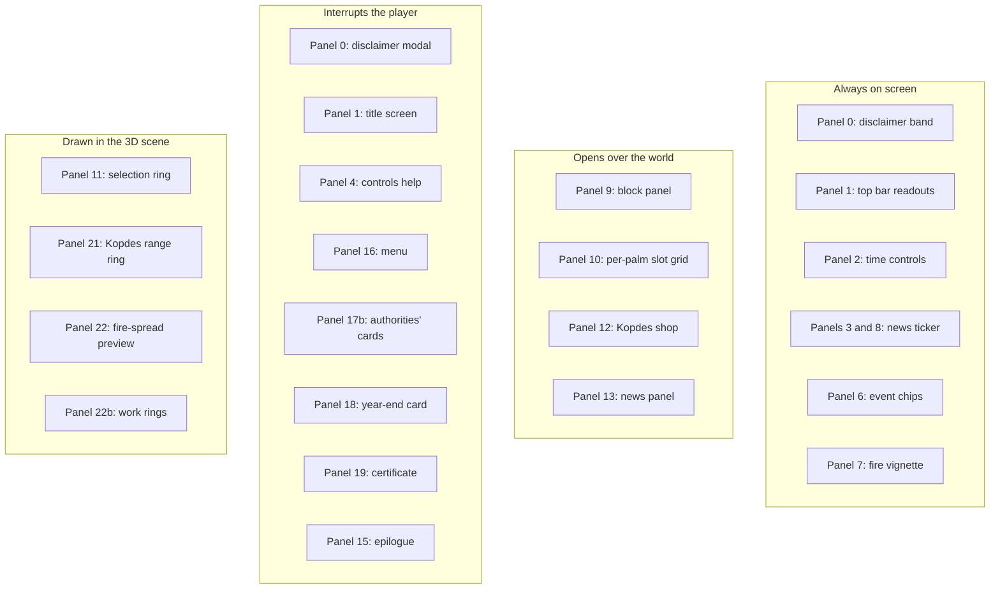

# GDD 8: the interface

The code cites this section 57 times, more than any other, and it does so panel
by panel: `GDD 8 panel 9`, `GDD 8 panel 13a`. This file answers each of those
citations in turn. A number with a letter after it (`5b`, `11a`, `13a`, `16a`,
`17b`, `22b`) is a panel added between two that already existed rather than a
child of the panel it shares digits with; two of the panels below turn out to
share a number outright, and that is noted where it happens rather than
resolved by guessing.

## Reading this section

`src/ui/svelte/` holds one folder per panel: `block/`, `hud/`, `news/`,
`authority/`, `shop/`, `endings/`, `start/`, with `base/` for the pieces that
carry no game vocabulary of their own (the phone frame, the tooltip, the
icon). Inside each folder, `<name>State.svelte.ts` is the panel's public
face: it holds the state, derives a plain localized snapshot from the sim,
and exposes the handful of methods `App.ts` calls. `App.ts` imports only that
file, never the `.svelte` component beside it, which is why the boundary
lint lets `src/app/` see `src/ui/` at all: what it sees is a state object,
not a template. [`docs/reference/ui.md`](../reference/ui.md) is the file to
open for what each component renders; this section is for what each panel is
_for_.

One rule holds across all of them: **a button is never simply missing.**
Where a command would be refused, the button stays on screen, greyed, and
carries the sim's own rejection reason as its title and (on the panel's major
actions) as a line of text under it. `sim/types.ts` calls this "GDD 8 copy
rules": _the UI shows `reason` verbatim_. The player learns what is not
allowed by reading, not by hunting for a hidden precondition.

The visual language is the same everywhere: cream cards (`--card`) with a
hard bottom edge (a drop shadow, `--card-shadow`, that reads as a pressed
lip rather than a floating panel), inset pills (`--pill`, `--pill-muted`) for
anything read-only, and chunky buttons that visibly press down on click. Two
panels borrow a cartoon smartphone frame (`base/Phone.svelte`) rather than a
plain card: the Kopdes shop and the news feed, both do their own scrolling on
a 400×840 screen inside a 480×920 frame.

Panels fall into four groups by where they live:

Toasts (panel 17) sit outside all four: they are the one notice that asks
nothing of the player and goes away on its own.

## GDD 8 panel 0: the disclaimer, its gate and its band

Two pieces of the same thing, and the only part of the interface that is not
about the estate at all. The game invents a district, a co-operative and a
row of named officials, and it lets the player burn forest for money; both
of those want saying out loud rather than leaving to be inferred.

**The gate** (`src/ui/svelte/disclaimer/DisclaimerModal.svelte`,
`disclaimerState.svelte.ts`, `data-testid="disclaimer-modal"`) stands between
the title screen's Play and the estate, not in front of the title. It is
raised by `play()` in `App.ts`, which every route into a run goes through:
Start a game, Continue, an estate code, and a new estate made from the title
card. The title stays up behind it and only fades on accept, so the gate reads
as the last step of pressing Play rather than as something in the way of the
game. A yellow warning band carries the `police-warning` icon and the heading;
under it sit the lead and three cards: nobody in the game is real, none of it
is advice, and clearing land is a choice the game prices rather than one it
recommends. `disclaimer-accept` is the only way out. There is no backdrop
click and no Escape binding, which is the one place the interface deliberately
refuses the player a shortcut: a gate that closes by accident has not been
read.

Acceptance is remembered in `localStorage` under `sawit:disclaimer`, against a
version, so the gate is passed once per browser rather than once per visit,
and changing the wording can put it back in front of everyone. A browser with
storage turned off sees it every time, which is the safe way to fail. The
`?seed` and `?fresh` URLs skip the title screen and the gate together, which
is how the browser suite reaches the estate; `landing.spec.ts` covers the
gate itself, on the path a real visitor takes, and pins the order: Play
raises the disclaimer, and the title is still standing behind it.

**The band** (`Marquee.svelte`, `marqueeState.svelte.ts`,
`data-testid="disclaimer-marquee"`) owns the very top edge of the page, above
the top bar rather than over it: `--marquee-h` is a fixed height that the bar
and the block panel's aside both start below, so the band costs the canvas
nothing and needs no measuring. It scrolls one sentence saying that the
forests outside the game do not grow back on a timer, and asking for
reboisasi, which is a thing to say in a game that pays the player to clear
them. The whole band is a button that reopens the gate, so the disclaimer
stays reachable after it has been accepted. Under
`prefers-reduced-motion` the scroll stops and the line simply centres.

## GDD 8 panel 1: the title screen and the top bar

The code applies this number to two different things, and nothing in it
resolves which the design meant: `startScreenState.svelte.ts` calls the
title screen "GDD 8 panel 1, design kit 5a", while `hudState.svelte.ts` calls
the top bar's input-price tile and forest-cover tile "GDD 8 panel 1" as well.
Both are the first things a player takes in, before a run and inside one, so
they are described here together rather than one silently dropped.

**The title screen** (`src/ui/svelte/start/StartScreen.svelte`,
`startScreenState.svelte.ts`, `data-testid="start-screen"`) is a modal over
the live estate, pulled back so the terrain reads as a dimmed backdrop; on
start or continue it fades over `START_FADE_MS` (650&nbsp;ms) while the
camera pulls in. It has two states, told apart by `data-mode`:

- `start`: first launch, or nothing saved in this browser. The large card
  offers `start-game`, a name box (`start-name`) and an estate-code box
  (`start-code`) whose preview (`start-code-preview`) updates as either is
  typed, `start-help`, `start-settings`, and three facts pulled straight
  from the balance tables (starting cash, the year palms first bear, how
  many endings there are).
- `continue`: a save exists. The medium `start-welcome` card names the
  estate (`start-estate`), when it was last saved, where it stands (year,
  day, hectares, cash) and a row of chips for whatever is going on there
  (fire, pests, the certificate checklist), then `start-continue`,
  `start-load-other` (the menu's saves and codes) and `start-new`.

The language toggle (`start-lang-en`, `start-lang-id`) sits over both states
in the top right, because it is the one setting a player might need before
they can read anything else.

**The top bar's readouts** (`src/ui/svelte/hud/Hud.svelte`,
`hudState.svelte.ts`, card `data-testid="hud"`) are the tiles that answer
"where does the estate stand right now": cash (`hud-cash`, which turns red
and gets a `!` when it is negative), the date (`hud-date`), the TBS price
with a trend arrow against roughly ten days ago (`hud-price`), the day's sky
and climate regime (`hud-regime`), and forest cover (`hud-forest`, coloured
orange under 25%). The input price index (`hud-inputs`) only joins the row
once it moves off 1 (`inputIndex > 1.005`), so a currency headline shows up
on the bar the moment it changes anything. Forest cover is
`estateForestCover()` in `src/sim/landscape.ts`, cited there as "GDD 8 top
bar": every owned block, plus everything within the landslide cover radius
of one, not just the estate's own footprint.

## GDD 8 panel 2: time controls

The pause/1×/10×/50× group in the top bar (`speed-0`, `speed-1`, `speed-10`,
`speed-50`, from `SPEEDS` in `src/app/timeControl.ts`). Pressing a button,
the number keys (`1`/`2`/`3` in `src/input/keys.ts`, which map to 1×, 10× and
50× respectively, not to array indices) and the menu all route through the
same `requestSpeed()` in `App.ts`, so nothing can start the clock at a speed
the estate has not earned.

50× stays locked (a lock icon, a disabled button, a tooltip naming the
level) until the Kopdes reaches `TURBO_KOPDES_LEVEL` (3): `speedNeedsKopdes()`
is the one place that rule lives. While anything is burning, the clock is
capped at `FIRE_LOCK_SPEED` (10×) regardless of what is requested, "so you
watch your fire" (`timeControl.ts`); a chip on the bar names the cap, and the
player's chosen speed comes back once nothing is alight.

## GDD 8 panels 3 and 8: the news ticker

`newsLane.ts`'s comment on the three news lanes cites "GDD 8 panels 3, 8,
13", and `NewsTicker.svelte`'s own module cites "GDD 8 panels 3 and 8" for
itself; nothing in the code distinguishes a separate panel 8 from the
ticker described as panel 3, so this entry covers both numbers as one panel
rather than inventing a second one to fill 8 with.

`NewsTicker.svelte` / `newsTickerState.svelte.ts` (`data-testid="news-ticker"`):
a strip along the bottom edge showing the latest three headlines
(`news-ticker-latest` marks the newest), each with a lane-coloured dot from
`newsLane.ts`'s `LANE_TONE` (natural, economic, government), a badge
(`news-unread`) when unread warnings are waiting, and `news-ticker-empty`
before anything has happened. Clicking it opens the full feed (panel 13).
Like the top bar, it slides out of the way over the title screen through
`setHidden()`.

## GDD 8 panel 4: controls help

`src/ui/svelte/start/ControlsHelp.svelte` / `controlsHelpState.svelte.ts`
(`data-testid="controls-help"`): a popover from the top bar's `help-button`
or the `H` key, positioned under the bar via the `--panel-top` custom
property `Hud.svelte` publishes. It lists the mouse bindings (click,
double-click, drag, scroll) and the keyboard ones straight out of
`src/input/keys.ts`: Space pauses, `1`/`2`/`3` pick a speed, `Q`/`E` snap the
camera a quarter turn, `F` jumps to the Kopdes, `K` opens the shop, `N` the
news, `H` (or `?`) this popover, `Escape` closes whatever is open.

## GDD 8 panel 5: the fire gauge

A tile in the top bar (`fire-gauge`, `hudState.svelte.ts`: "GDD 8 panel 5:
shown once any burn has happened"), appearing once `firePressure > 0.01` or
a wildfire is running. It draws a gauge from `firePressure` against
`FIRE.wildfireThreshold`, turning gold past 60% of the line and red past it,
where it also gets the alert ping. A `burning-chip` names how many blocks are
alight, and a `wildfire-badge` appears once the fire has stopped being the
player's own (`isWildfire()`).

## GDD 8 panel 5b: the attention gauge

Also a top-bar tile (`attention-gauge`), but it only exists once the
authorities have written: `hudState.svelte.ts` calls it "shown only once the
first letter has arrived (GDD 3.9); null hides it". `App.ts`'s
`watchedByAuthorities()` keeps it in the bar while `attention > 0`, a
`warningLevel` is set, or an investigation or ban is running, and drops it
again once the estate has a clean sheet rather than leaving a permanent
zero on screen. It reddens and pings past 70.

## GDD 8 panel 6: the event chips

The strip under the top bar card (`events-strip`), one chip per active thing
worth naming: haze or smoke, ash, flood (with how many blocks and whether
it is only downstream), drought, plague, whichever macro-deck headline is
running (`MACRO_PREFIX`-tagged events), an operating ban, an unpaid,
insolvent stretch, and an open investigation. Each chip (`event-chip-${id}`)
carries a tone (`fire`, `smoke`, `ash`, `water`, `dry`, `pest`, `econ`) that
sets its colour and, where the event has a clock, a days-left count. Built
fresh every refresh by `eventChips()` in `App.ts`.

## GDD 8 panel 7: the fire vignette

Not a panel with buttons: an edge vignette over the whole stage
(`App.ts`, "Edge vignette while anything burns"), an inset orange glow whose
opacity steps to `0.6` for an ordinary burn and `1` for a wildfire, and back
to `0` once nothing is alight. It exists so the player feels the fire
without having to be looking at the tile that shows it, the same instinct
`syncFireAudio()` follows by keeping the crackle low but constant.

## GDD 8 panel 9: the block panel

`src/ui/svelte/block/BlockPanel.svelte` / `blockPanelState.svelte.ts`
(`data-testid="block-panel"`), laid over the world as an `aside` on the right
edge rather than docked, so the canvas never resizes when it slides in; the
HUD and ticker shift left instead, through the `--chrome-right` custom
property (`App.ts`). It opens with a selection and closes on `close()`.

Everything in it comes from one function, `blockView()`, called fresh every
refresh against the current sim state and the selected slot, so what is
shown is never stale by more than one poll (`UI_REFRESH_MS`, 100&nbsp;ms).
The header names the block (`block.block`), its title and its phase
(`block-phase`, which reads "clearing" while a plantation's felling crew is
on it even though the sim still files the block as planted). The tile grid
covers ownership and price, elevation, moisture (with a gauge), distance to
the Kopdes (`block-range`, with a spoil warning out of range), plantable
slots, debris (`block-debris`), ash fertility, fertilizer window, and slope
risk (`block-slope`, a wet-season landslide estimate from `landslideChance()`
at an ordinary three-day wet streak, so the number reads stably).

Below the tiles, whichever of these apply to the block appear as their own
sections: a Kopdes card with `action-OpenShop`, the auto-harvest toggle
(`toggle-auto-harvest`) and, only with something to settle, the coordination
fee (`action-SettleInvestigation`, GDD 3.9); a Kopdes report (`kopdes-report`, panel 19a) on the Kopdes block; a stand card (`stand-card`, panel 17a) naming
the stage the stand is mostly in, a three-segment progress bar, and either
`growth-progress` or, once fruit is on the trees, `harvest-info` with
`harvest-note`; a pest card
(`pest-section`, GDD 3.4) with beetle and Ganoderma readouts
(`pest-beetles`, `pest-ganoderma`, `plague-badge`) and up to four treatment
buttons; a burn card (`burn-section`, panel 22); the open-land footer
(panel 11a); the plain list of major and minor actions each block phase
offers (chop, plant, fertilize, harvest, irrigate, drain, cover-crop,
upgrade, all sharing the `action-${Command}` test-id convention); and the
danger zone (panel 13a). A block that is not owned shows only `action-BuyBlock`.

## GDD 8 panel 20a: the first load

A fresh estate opens on the pre-cleared block with the selection ring already
on it and a pin over it whose card stays open: the caption, the headline
"Place Workshop (Kopdes) here!" and the sub "Click this cleared block to build
it." The pin goes the moment the Workshop is placed, and the ring behaves as
the cursor it always is. Nothing else on a first load asks for attention
until this is done, so the one thing to click is the one thing marked.

## GDD 8 panel 10: the per-palm slot grid

Inside the pest card, a clickable 12×12 grid (`slot-grid`, one
`slot-cell-${n}` per slot) standing in for "the per-palm panel of GDD 8 #10
without needing per-palm 3D picking" (`blockPanelState.svelte.ts`). A cell's
colour tracks growth stage and Ganoderma state, sick and infectious-dead
slots carry a `data-sick` mark, and trenched slots get a blue ring. Clicking
a slot opens `slot-detail`: a live palm offers `action-RemovePalm` and
`action-TrenchPalm`, priced from `PEST_LABOUR`; an empty slot just names
itself.

## GDD 8 panel 11: the selection ring

Not a UI panel but the in-scene marker that stands in for one:
`SelectionRing` in `src/render/scene/Overlays.ts` ("GDD 8 #11"), a flat blue
frame with an additive halo that pops in with `easeOutBack` on every click,
unlit and brighter than white so it reads against any ground and blooms
under the glow pass. It keeps pulsing while the estate runs and holds still
while paused, because the pop-in itself still has to answer a click even
with the clock stopped.

## GDD 8 panel 11a: open land's footer

The block panel's footer for a wild, ownable, non-burning block whose biome
allows the choice (`spec.openLand`): "open land's two futures, the crew with
its timber, or the saplings" (`landView()`, `blockPanelState.svelte.ts`).
The loud option is `action-ChopBlock`, priced by `chopCost()` with the
biome's chop days named beside it; the quiet one is `action-ReforestBlock`,
which buys exactly the saplings the block is short (`saplingShortfall()`)
and plants them in the same press, so the price shown is the whole price.
It reads `locked` when there is no Kopdes in range to buy from (a different
kind of no from being short of cash, which instead reads as
`reforestPoor`).

## GDD 8 panel 12: the Kopdes shop

`src/ui/svelte/shop/KopdesShop.svelte` / `kopdesShopState.svelte.ts`, on the
phone frame (`data-testid="kopdes-shop"`), with `shop-tab-buy` and
`shop-tab-sell` tabs. The Buy tab lists one row per item (`bibit`,
`forestSapling`, `fertilizer`, `sanitationCrew`, `excavationCrew`,
`pheromoneTrap`, `metarhizium`, `trichoderma`), priced at `base ×
inputPriceIndex`, current stock (`stock-${item}`), and a button per bundle
size from `BUNDLES` (`buy-${item}-${quantity}`, for example 144 or 12 bibit
at a time, one pheromone trap or three). The Sell tab shows today's TBS
price and its trend (`shop-price`, `▲`/`▼`/`▬` against roughly the price ten
days back), the auto-harvest toggle, the last five sales, the worker roster
(`shop-workers`, one `worker-${kind}` button each, locked below
`WORKERS_FROM_LEVEL` (Kopdes level 3) with a `data-locked="kopdes"` marker)
and the upgrade button (`shop-upgrade`, cost from `kopdesUpgradeCost()`,
disabled once at max level). The Kopdes range ring (panel 21) is drawn on
the map for as long as the shop stays open.

## GDD 8 panel 13: the news panel

`src/ui/svelte/news/NewsPanel.svelte` / `newsPanelState.svelte.ts`, the phone
frame's full feed (`data-testid="news-panel"`), newest first
(`news-list`, `news-item`), with lane filters (`news-filter-all`,
`-natural`, `-economic`, `-government`) and, where a headline names a block,
a click that both selects and focuses the camera on it. An unread count
(`news-unread-badge`) clears with `news-mark-read`, and closing the panel
marks everything read as well, since "looked at" is what a read notice
means here, not merely opened.

## GDD 8 panel 13a: the danger zone

The block panel's one irreversible action: "the one thing on a planted
block that cannot be taken back, felling the lot" (`blockPanelState.svelte.ts`).
Folded shut by default (`danger-zone` footer, `danger-toggle`,
`aria-expanded`) so it never competes for attention with Harvest or
Fertilize, and it asks twice: the first press on `action-ClearPlantation`
opens `clear-confirm`, a list of exactly what goes (palms, fruit already on
the trees, years of growth), with `action-ClearPlantation-cancel` and
`action-ClearPlantation-confirm` to finish or back out. The price
(`clearPlantationCost()`, `CLEAR_PLANTATION.perPalm` per palm standing at
the day's input index) buys nothing back: no timber, no fruit. A crew works
the block for `CLEAR_PLANTATION.days` (12) with the palms still standing,
and every one of them comes down together on the last day.

## GDD 8 panel 15: the epilogue

`src/ui/svelte/endings/Epilogue.svelte` / `epilogueState.svelte.ts`
(`data-testid="epilogue"`, `data-ending`): how the run ended, framed by
`LOOK[ending]` (kicker, title, one-line verdict, an icon and a colour band
per ending), a headline note quoting the news item that closed it, an
ending-specific note (a reboisasi quote and sponsor line, a redemption
quote, or the President's line for a certified estate), a stat grid
(`epilogue-stat`) whose fields are picked per ending (profit, hectares
burned or planted, forest cover, disasters, palms lost, and so on) and a
collapsible chronicle (`epilogue-timeline`, `epilogue-timeline-toggle`,
capped at `CHRONICLE.cap` entries). `WON` in `App.ts` (`clean`, `dirty`,
`reboisasi`, `redemption`) decides whether the footer offers
`epilogue-keep-playing` (sandbox, GDD 3.8's `KeepPlaying` command) alongside
`epilogue-new-estate`; a loss instead offers a rewind to any of the last
few year-starts still snapshotted (`epilogue-rewind-${year}`), since losses
have no sandbox, only the rewind.

**It is the one panel with no way out but a decision.** There is no close
button, no backdrop click and no Escape binding (`App.ts`'s `escape()` returns
early while it is open), and it sits at `z-[65]`, above the disclaimer band, so
the only live controls on the screen are its own two buttons. The run is over;
the player says how it continues rather than dismissing the fact.

**A certificate won over burned ground is told so.** Where the ending is
`clean` or `dirty` and `run.stats.burns` is above zero, the verdict line gains
a bold tail (`epilogue.arsonistLead`, `epilogue.arsonistShout`) and a red note
card (`epilogue-arsonist`) goes in above the President's. It is the one place
the game addresses the player rather than the estate, and it is deliberately
not shown for `redemption`: that ending is already the answer for its fires,
and scolding it would contradict what the game just said.

**The forest wins are lit.** `reboisasi` and `redemption` share the gold band
(`FOREST_BAND`) and carry `.epilogue-glow`, a gold halo that breathes on a
slow cycle and holds still under `prefers-reduced-motion`. The 3D bloom in
`render/Glow.ts` cannot reach a DOM panel, so the glow is CSS. The certificate
wins keep the quieter `WIN_BAND` they always had: the game's best ending
should not look like its most common one.

## GDD 8 panel 16: the menu

`src/ui/svelte/start/Menu.svelte` / `menuState.svelte.ts`
(`data-testid="menu"`, `data-step`). Its face carries what is currently
running (`menu-estate-name`, `menu-estate-code`, or `menu-no-estate`),
`menu-save` (disabled with nothing in play) and `menu-load` (disabled with
nothing saved), the sound toggle (`menu-sound`) and the language buttons
(`menu-lang-en`, `menu-lang-id`), and finally `menu-new`, whose label and
colour change with the stakes: a quiet grey question ("start a new estate?")
with a run in play, the coral call to action with nothing to lose.

## GDD 8 panel 16a: starting a new estate

The menu's second step (`openNew()`, `data-step="new"`): a name box
(`menu-name`), a seed box (`menu-seed`) whose preview (`menu-code-preview`)
updates live, and, whenever there is a run or a save that a new estate would
replace, a `menu-replace-warning` naming what is at stake. `menu-new-create`
stays dead until the estate has a name (`nameable`); `menu-new-cancel`
either steps back to the menu's face or closes it outright, depending on
whether the form was opened directly from the title screen's own "new
estate" (`openedIntoForm`), so a player never reopens the menu to find a
half-filled form pointed at the estate they meant to keep.

## GDD 8 panel 17: toasts

`src/ui/svelte/hud/toastsState.svelte.ts` (`data-testid="toast"`): transient
notices that pop in, slide from the left and fade out on their own after
`ttlMs` (4500&nbsp;ms by default). At most `AT_ONCE` (2) sit on screen
together; pushing a third drops the oldest rather than stacking the bar
taller. They carry a tone (`info`, `warn`, `error`) and are the one panel
nothing else has to close: every rejected command, every autosave failure
and every caught mob speaks through here.

## GDD 8 panel 17b: the authorities' cards

`src/ui/svelte/authority/AuthorityCards.svelte` / `authorityCardsState.svelte.ts`
(`card-${kind}`, for `letter`, `investigation` and `ban`): the interruption
that stops the clock so it gets read. A letter (`GDD 3.9`) is a single
`card-dismiss`; an investigation card lists what is banned while it runs,
that harvests still go on, and the risk of a second fire, plus, only where
the district office will still take it, the coordination fee
(`card-settle`, or `card-settle-unavailable` naming why not); an operating
ban lists the same shape of consequences for a longer, harsher freeze.
Dismissing any of them restarts the clock if the estate was paused only to
show the card (`closeCard()` in `App.ts`). The arrest is not a card here: it
is an ending, and the epilogue (panel 15) tells it.

## GDD 8 panel 18: the year-end card

`src/ui/svelte/endings/YearEndCard.svelte` / the `YearEndCard` class in
`certificateState.svelte.ts` (`data-testid="year-end-card"`): not modal, and
it clears itself. It shows the year just closed, its profit or loss, mature
hectares, forest cover with the change from the year before, and, from Year
3 on, the certificate count out of 5. It holds for `holdMs` (12,000&nbsp;ms by
default) unless dismissed early with `year-end-dismiss`.

## GDD 8 panel 19: the Palm Certificate

`src/ui/svelte/endings/CertificatePanel.svelte` / the `CertificatePanel`
class in `certificateState.svelte.ts` (`data-testid="certificate-panel"`),
reachable from the top bar's `hud-cert` button once the run has reached
`CERTIFICATE.progressFromYear` (Year 3): "so the win is legible before it happens."
The button itself carries three states (`data-state="none"`, `"progress"`,
`"certified"`): nothing met is neutral, some met turns it gold, all
`CERTIFICATE_CONDITIONS` (5) met turns it green and shows a waiting dot for the
Ministry's next year-end check, which is what actually closes the run. The
panel lists each condition (`certificate-condition-${id}`: profit,
hectares, no burns, forest floor, Kopdes level) with a progress bar, a met
badge or a days-to-go estimate for the no-burn clock, and a segmented count
bar (`certificate-segments`) that fills from the left regardless of which
conditions happen to be met.

**Once won, it stays won.** `conditionsNow()` in `App.ts` reads every
condition as met from the moment `hasWon(state)` is true, and the bar's pip
count follows. The sandbox exists so a certified estate can be played on, and
played on it will drift: profit dips, a Kopdes is sold back, forest cover
falls. A checklist that un-ticked itself would be telling the player they had
lost something the Ministry has already awarded. The freeze is in the app, not
the sim, so `certificateConditions()` keeps answering honestly for the year
close that decides the ending in the first place.

## GDD 8 panel 21: the Kopdes range ring

`RangeRing` in `src/render/scene/Overlays.ts`: a thin frame on every block
the Kopdes can currently sell for, drawn on the map only while the shop
(panel 12) is open, and rebuilt whenever the Kopdes moves or levels up. The
same flat, self-lit material as the selection ring, a shade deeper and
thinner, because a few hundred of these can be on screen at once and they
mark the estate's edge, not the one block the player is looking at.

## GDD 8 panel 22: the fire-spread preview

Two halves of one preview, both triggered by hovering a Burn option in the
block panel's burn card (`hoverBurn()`, `blockPanelState.svelte.ts`: "Hovering
a Burn button previews which neighbours could catch"). The panel side is
`burn-preview`, a line naming how many neighbouring blocks carry fuel and,
under El Niño, that the risk is doubled. The scene side is `HazardRing` in
`src/render/scene/Overlays.ts`, which highlights exactly those blocks on the
map for as long as the pointer stays over the option, so a player sees the
same neighbours the text names.

## GDD 8 panel 22b: work progress rings

`src/ui/svelte/hud/WorkMarkers.svelte` / `workMarkersState.svelte.ts`
(`data-testid="work-marker"`): a circle pinned above any block a crew is
working, filling as the chop, the burn or the excavation dig advances. The
App projects each worked block's screen position every frame and hands the
list over; the marker itself never touches the camera.
