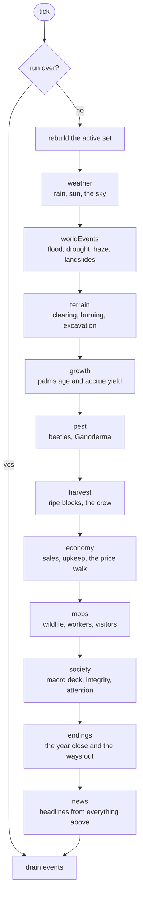
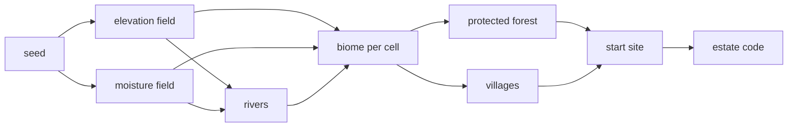

# The simulation

A tick is a day. At normal speed a day passes every ten seconds; at 50x it
passes five times a second, which is what makes the ordering below matter.

## What happens on a tick

`Sim.tick()` in `src/sim/index.ts` runs eleven systems in a fixed order and
returns the events they raised.



The order is not arbitrary:

- **Weather first**, because almost everything downstream reads it: fire
  spread, growth, landslides, the price of fruit.
- **Harvest before economy**, so fruit picked today is sold at today's price
  rather than tomorrow's.
- **Society after economy**, so the authority meter sees the burn that
  happened this tick, including burns from commands the player dispatched
  since the last tick, whose events are waiting in the same sink.
- **News last**, because it reports on everything above it. It reads the
  tick's events and writes headlines; nothing reads back from it.

## Only what changed

A 64 by 64 map is 4,096 blocks and stepping all of them every day would be
wasteful, so the sim keeps two things small:

- **The block map is sparse.** `state.blocks` holds only blocks that have
  diverged from what worldgen would generate. Everything else is a pure
  function of the seed and the coordinates, computed on demand and cached.
- **The active set is rebuilt each tick.** Systems walk the blocks that can
  change, not the map.

## The world is a seed

`createWorld(seed)` is deterministic: elevation, moisture, rivers, the
protected forest, the villages and the start site all fall out of the seed.
The same estate code always builds the same map, which is why a code can be
shared at all.

Random draws inside a run come from forked streams (`forkRng(seed, tag)`), so
the weather cannot be shifted by how many times the mobs rolled.



## Commands

The player changes the world in exactly one way: a command. Each lives in its
own file under `src/sim/commands/`, and each has the same shape.

```ts
validate(ctx, command): Rejection | null;  // why not, in a sentence
apply(ctx, command): void;                  // what happens
```

The registry in `commands/index.ts` is the only place that maps a command's
name to its handler. Commands are recorded in `state.commandLog`, which is
what makes a run replayable.

## The headline deck

The country acts on the estate through a weighted deck of headlines in
`balance/macroEvents.ts`. Each entry declares what it does, and every lever is
read in exactly one place through `src/sim/macro.ts`, so an event can only
touch what it says it touches: shop prices, land, wages, yield, slope risk,
how fast the authorities forget, the coordination fee, whether wildlife
comes, a daily contract, or a quiet spell in which nothing may be drawn.

Four of the entries are not dealt at random. Haze, the wildlife going, a
species listed and the photographs from the fire line answer to what the
player has actually burned.

## Testing it

- **Unit tests** (`pnpm test`) run the sim headlessly, which is possible
  because it never touches the DOM.
- **The sweep** (`pnpm sweep`) plays whole runs with an autoplayer and prints
  cash, profit, yield and ISPO progress per year across seeds. It is how a
  balance change is judged.
- **The browser suite** (`pnpm e2e`) drives the built game in Chromium: it
  boots, plants, harvests, burns, saves, reloads and reads the screen back.
